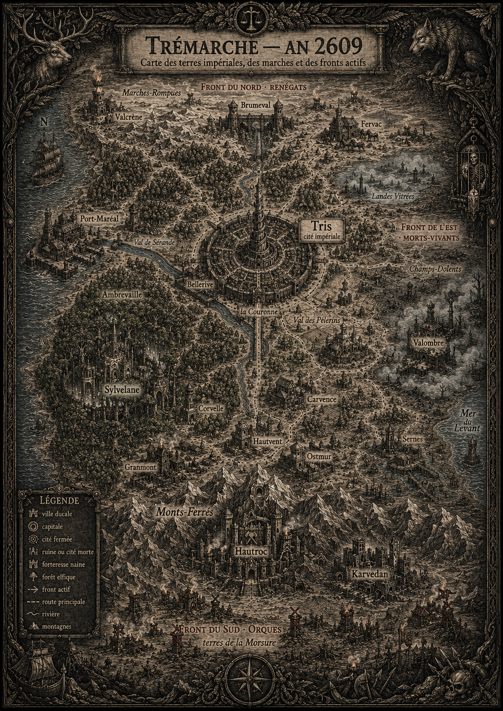

# Vue générale du monde

## Nom du monde
> Statut : draft

1. **Orvande** — sobre, ancien, prononçable. Recommandation principale.
2. **Vespérande** — évoque le crépuscule ; tonalité sombre, risque de suggérer un monde « finissant ».
3. **Carmise** — sonorité minérale et chaude, plus neutre.

Les prêtres de Mitra appellent parfois le monde « la Grande Argile », en référence à leur mythe.

## Le continent
> Statut : draft (nom) / canon (structure)

Le continent connu porte, en proposition principale, le nom de **Trémarche** — « les Trois Marches », d'après les trois frontières de guerre (sud, est, nord). Autres propositions : **Bastagne**, **Vallonde**.

*Carte illustrée de Trémarche en l’an 2609, dans un style de gravure médiévale. Statut : draft — support visuel de la géographie générale ; l’image ne remplace pas les descriptions canoniques et ne canonise pas les détails cartographiques non validés.*

Sa structure canonique (v2) :
- Au centre et à l'ouest : l'Empire humain, ses treize grandes villes ducales et Tris, la cité impériale.
- **Au sud** : la chaîne des Monts-Ferrés, domaine des nains ; au-delà, les terres de la Morsure d'où déferlent les hordes d'orques et de gobelins, par les cols et par la brèche de Karvedan.
- **À l'est** : anciens royaumes, tombes, marais du Levant — le domaine grandissant des morts-vivants et des nécromanciens.
- **Au nord** : hautes terres et provinces séparatistes tenues par les renégats.
- Dans les forêts, dispersées sur tout le continent (la grande Ambrevaille de l'ouest en tête) : les sociétés elfiques.
- Dans les montagnes du sud, sous les cimes : les forteresses des nains, premier rempart entre les orques et l'Empire.

## Situation politique en l'an 2609
> Statut : canon

L'Empire humain, gouverné par Alexandre III depuis Tris, la cité impériale, mène la guerre sur trois fronts simultanés. Les treize ducs fournissent hommes, grain et impôts — avec un zèle inégal. L'Empire reste officiellement neutre envers elfes et nains, deux peuples qui se haïssent entre eux mais combattent les mêmes ennemis.

## Les zones de conflit
> Statut : canon (faits) / draft (noms propres)

1. **Front du Sud** — les Marches du Piémont, au pied des Monts-Ferrés. La Horde de la Dent, rassemblée par Gharok Mange-Pierre, a pris Fort-Guivre en 2607 et presse Ostmur. Cols, brèche de Karvedan, forteresses, villages brûlés.
2. **Front de l'Est** — les Champs-Dolents et les Marais des Roseaux du Levant. Depuis la Nuit des Tombes Ouvertes (2431), les morts ne reposent plus à l'est. Plusieurs foyers distincts : le Roi des Roseaux, la Dame en Deuil, le Cercle du Ver.
3. **Front du Nord** — les Marches-Rompues. Depuis le Repli (2597), forteresses saisies, nobles rebelles, déserteurs, contrebande. Six forces renégates distinctes.
4. **Fronts forestiers** — la Haute-Lisière et les abords d'Ambrevaille. Des clans elfes isolés et des gardiens radicaux attaquent bûcherons et patrouilles.

## Niveau technologique
> Statut : draft

Bas Moyen Âge tardif : acier forgé, mailles et plates simples, arbalètes, engins à contrepoids, moulins, charrois. Pas de poudre noire. Pas d'imprimerie : les copistes de Mitra détiennent le livre.

## Magie
> Statut : canon (principes) / draft (organisation)

Rare, difficile, dangereuse, surveillée. Trois ordres liés à Mitra l'étudient sous le contrôle du Registre de la Balance. La nécromancie est un crime capital dans tout l'Empire.

## Routes, ruines, frontières
> Statut : draft

- La **Sérande**, grand fleuve qui descend des Monts-Ferrés, passe par Tris et rejoint la mer à l'ouest. Le **Grand-Chemin** relie les treize villes à la capitale.
- Ruines exploitables : forteresses de la Guerre des Treize Couronnes, cryptes de Valdorée, mines naines abandonnées, sanctuaires elfiques scellés, Landes Vitrées du Fracas.
- Les frontières sont matérielles : bornes ducales, postes de péage, tours à feu, palissades villageoises.
