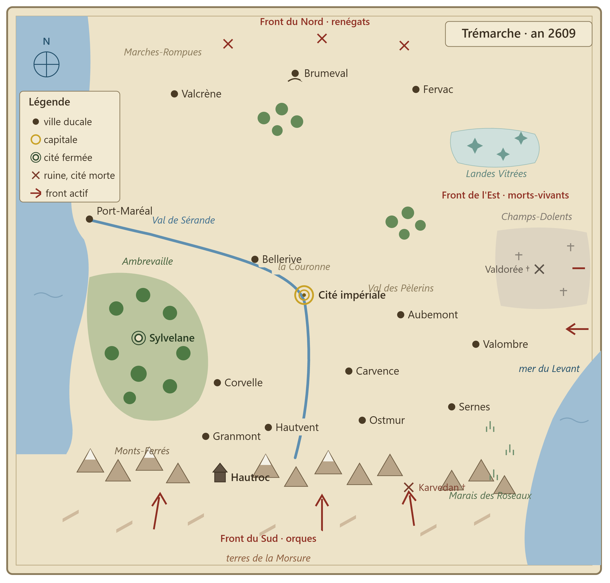

# Continent et régions

Treize grandes régions. Géographie canon v2 : **orques au sud** (au-delà des Monts-Ferrés) ; **nains dans les montagnes du sud** ; **morts-vivants à l'est** ; **renégats au nord** ; **elfes dispersés dans les forêts**. Deux mers : à l'ouest (Côte du Sel) et à l'est (mer du Levant). Tous les noms sont draft.

*Carte schématique de Trémarche en l’an 2609, présentant les régions, les principales villes et les fronts. Statut : draft — outil de repérage géographique à comparer aux textes ; l’image ne remplace pas les descriptions canoniques et ne canonise pas les détails non validés.*

## 1. La Couronne — region_crown_lands
Plaines fertiles autour de Tris, la cité impériale, au cœur du bassin de la Sérande. Ressources : blé, vignes, administration. Menaces : intrigues, guildes de voleurs infiltrées. Niveau : zone de départ / hub politique.

## 2. Le Val de Sérande — region_serande_valley
Vallée du grand fleuve, qui naît dans les Monts-Ferrés au sud, passe par Tris et rejoint la mer à Port-Maréal. Duché de Bellerive. Ressources : péages, halles, barges. Niveau : commerce, banquets.

## 3. La Côte du Sel — region_salt_coast
Littoral ouest. Duché de Port-Maréal. Culte de Mahra puissant. Ressources : sel, poisson, commerce maritime. Niveau : intrigue portuaire.

## 4. La Haute-Lisière — region_forest_border
Bocage contre la forêt d'Ambrevaille. Duché de Corvelle. Menaces : escarmouches elfiques. Niveau : diplomatie tendue.

## 5. La forêt d'Ambrevaille — region_ambrevaille_forest
Immense forêt de l'ouest, cœur du peuple elfe. Cité fermée de Sylvelane. D'autres bois, dispersés sur tout le continent, abritent des clans mineurs. Niveau : exploration, faction elfe.

## 6. Les Monts-Ferrés — region_iron_mounts
Grande chaîne du **sud** du continent. Royaume nain (capitale Hautroc). Au sud de la chaîne : les terres orques. Les nains vivent littéralement au-dessus des orques et forment le premier rempart de l'Empire. Ruines : Karvedan la perdue (1043), brèche dans la chaîne. Niveau : donjons souterrains, faction naine.

## 7. Les Marches du Piémont — region_piedmont_marches
Glacis fortifié au pied nord des Monts-Ferrés : Ostmur, Carvence, Hautvent. Menaces : Horde de la Dent, raids gobelins. Ruines : Fort-Guivre (tombé 2607). Niveau : front de guerre principal.

## 8. Les terres de la Morsure — region_morsure_plains
Steppes **au sud** des Monts-Ferrés. Population : clans orques, camps de la Horde. Esthétique : herbe jaune, totems de viande séchée. Niveau : territoire ennemi.

## 9. Le Val des Pèlerins — region_pilgrim_vale
Collines tempérées à l'est de la Couronne. Duché d'Aubemont. Routes de pèlerinage vers les sanctuaires de Mitra, dangereuses. Menaces : incursions mortes-vivantes des Champs-Dolents. Niveau : quêtes religieuses.

## 10. Les Champs-Dolents — region_dolent_fields
Ancien grenier du royaume de Valdorée, à l'**est**, frappé par la Nuit des Tombes Ouvertes (2431). Duché de Valombre. Ruines : Valdorée la cité morte. Niveau : cœur du front de l'Est.

## 11. Les Marais des Roseaux — region_reed_marshes
Grands marais du **sud-est**, sur la côte de la mer du Levant. Duché de Sernes en lisière. Faction : cour du Roi des Roseaux. Menaces : goules, noyés, brume, fièvre blême. Niveau : zone de haut danger.

## 12. Les Landes Vitrées — region_glass_moors
Désolation du **nord-est**, séquelle du Fracas (1122). Sol fondu en verre. Zone tampon inquiétante entre front renégat et front des morts. Menaces : veilleurs de verre, magie résiduelle. Niveau : très haut niveau.

## 13. Les Marches-Rompues — region_broken_marches
Hautes terres froides du **nord**. Duchés loyaux de Valcrène, Fervac, Brumeval face aux terres sécessionnistes. Menaces : renégats de toutes obédiences, cultes interdits. Niveau : front nord, guerre civile larvée.
