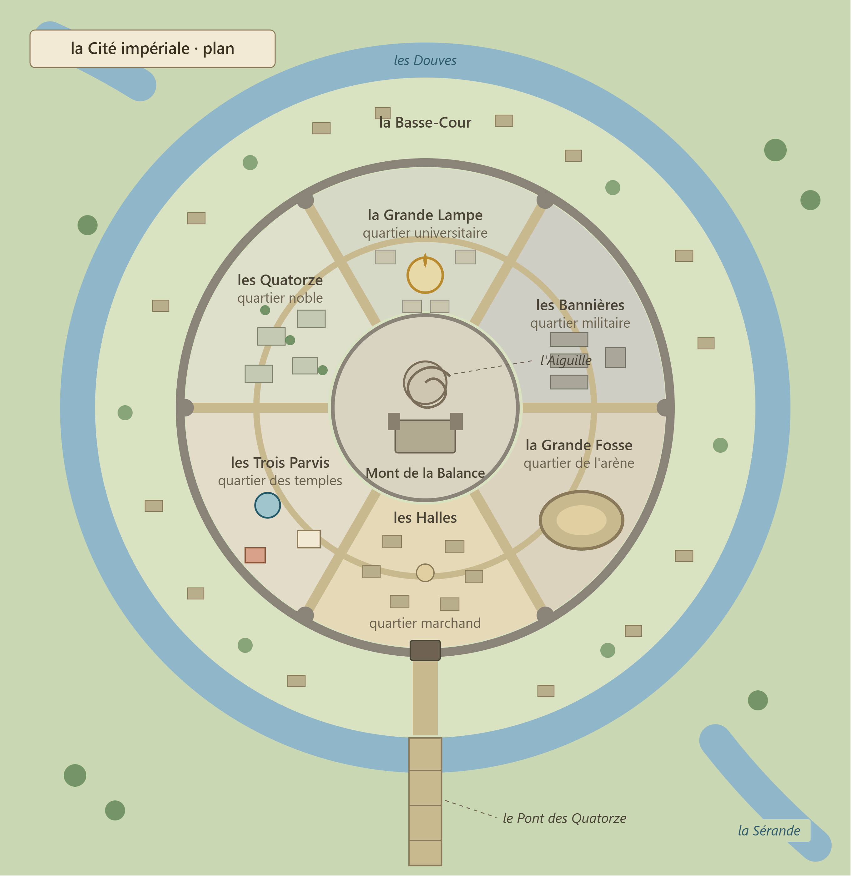

# Tris, la cité impériale

*Plan illustré de Tris. Statut : draft — support visuel de la structure concentrique et des quartiers ; l’image ne remplace pas les descriptions canoniques du texte.*

## Résumé
> Statut : canon

Capitale de l'Empire. Nom propre officiel : **Tris**. « La cité impériale » est sa désignation fonctionnelle. Structure imposée par le créateur : ville concentrique. Un large premier cercle extérieur — la basse-cour — entoure la ville ; un grand pont franchit les douves ; derrière la muraille, six quartiers entourent le centre ; au milieu se dresse un grand château dominé par une haute tour en spirale.

Disposition des six quartiers depuis l'entrée du pont, en tournant vers la droite : **les Halles** (marchand), **la Grande Fosse** (arène), **les Bannières** (militaire), **la Grande Lampe** (universitaire), **les Quatorze** (noble), **les Trois Parvis** (temples), qui referme le cercle sur les Halles. Au centre : le Mont de la Balance (palais, politique).

## Surnoms
> Statut : draft
« La Ville-Balance » (marchands), « la Plaine couronnée » (lettrés), « le Grand Plateau » (soldats), « la Pesée » (argot des voleurs).

## Fondation et site
> Statut : draft

Bâtie à partir de l'an 3 sur la plaine du Jugement, terrain neutre. Le site : une île basse de la Sérande, dont les deux bras élargis forment les douves. La ville a poussé en cercles depuis le tertre central.

## Structure concentrique
> Statut : canon (structure) / draft (noms propres)

- **La Basse-Cour** : large anneau extérieur, entre berge et muraille. Faubourgs sous palissade : marchés aux bestiaux, tanneries, auberges de rouliers. Quiconque entre en ville y passe d'abord.
- **Les Douves** : les deux bras de la Sérande. Eau vive, chaînes de batelage.
- **Le Pont des Quatorze** : l'unique passage lourd, au sud. Grand pont de pierre à trois arches et deux barbacanes. Les péagers tiennent registre de tout ce qui entre.
- **La muraille** : enceinte principale, six tours majeures aux six rues radiales.
- **Le Cerne** : rue de ronde circulaire desservant les six quartiers.
- **Le Mont de la Balance** : tertre central fortifié. Palais impérial, salle du Conseil des Quatorze, balance monumentale. **L'Aiguille** — haute tour en spirale dont la rampe extérieure s'enroule jusqu'à la lanterne sommitale. Le Grand Degré, avenue processionnelle bordée des statues des empereurs, monte du Pont au Mont.

## Les six quartiers
> Statut : draft (noms) / canon (fonctions et disposition)

1. **Les Halles** — quartier marchand. Marchés couverts, comptoirs de la Hanse, changeurs, port fluvial intérieur.
2. **La Grande Fosse** — quartier de l'arène. L'arène impériale (vingt mille places), ses écuries, écoles de combat, tavernes de parieurs.
3. **Les Bannières** — quartier militaire. Casernes, forges d'armes, cour d'exercice, chapelle-forteresse de Mola, bureaux du Connétable.
4. **La Grande Lampe** — quartier universitaire. Temple-université de Mitra, grande bibliothèque, siège du Registre de la Balance et des ordres de mages.
5. **Les Quatorze** — quartier noble. Les treize hôtels ducaux, résidences des grandes familles ; rivalités d'étiquette, banquets, espions.
6. **Les Trois Parvis** — quartier des temples. Grands sanctuaires de Mitra, Mahra et Mola autour de trois parvis contigus.

## Gouvernement et garnison
> Statut : draft

Administrée par un **Prévôt de la Cité**. Garnison impériale aux Bannières ; Garde de la Balance au Mont. Le prince Gaëtan, frère de l'empereur, commande la place.

## Esthétique
Pierre claire, toits d'ardoise bleue, bannières noires à la balance d'argent, lampes votives à chaque carrefour. Low-poly : anneaux concentriques, six secteurs, une tour-spirale unique en skyline.
