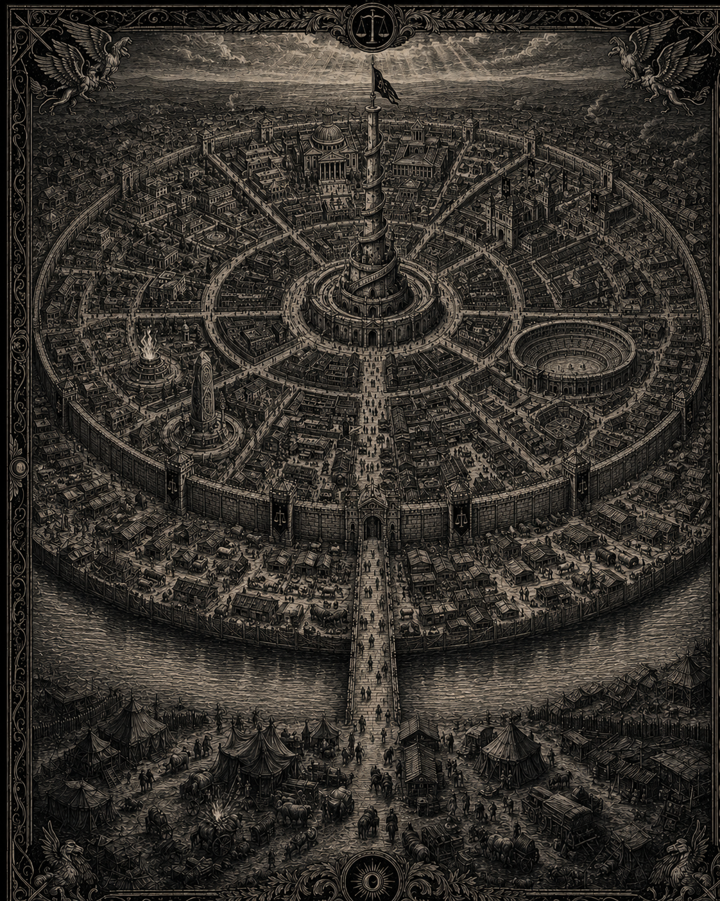

# Tris, la cité impériale

*Plan illustré de Tris. Statut : draft — support visuel de la structure concentrique et des quartiers ; l’image ne remplace pas les descriptions canoniques du texte.*

*Illustration de Tris vue depuis le pont, avec un soldat impérial au premier plan. Statut : draft — représentation visuelle de la cité, de son entrée fortifiée et de l’autorité impériale ; elle ne remplace pas les descriptions canoniques du texte.*

## Résumé
> Statut : canon

Capitale de l'Empire. Nom propre officiel : **Tris**. « La cité impériale » est sa désignation fonctionnelle. Structure imposée par le créateur : ville concentrique. Une large basse-cour extérieure entoure la cité ; avant le pont se dressent les tentes et campements des voyageurs ; un pont droit, unique accès franchissant les douves, relie cette basse-cour à la porte de la ville ; derrière la muraille, six quartiers entourent le centre ; au milieu se dresse l'Aiguille, une haute tour en spirale de pierres blanches où flottent les bannières de l'Empire.

Disposition des six quartiers depuis l'entrée du pont, en tournant vers la droite : **les Halles** (marchand), **la Grande Fosse** (arène), **les Bannières** (militaire), **la Grande Lampe** (universitaire), **les Quatorze** (noble), **les Trois Parvis** (temples), qui referme le cercle sur les Halles. La Grande Fosse se trouve donc à droite des Halles ; les Bannières la dominent ; la Grande Lampe est à gauche des Bannières ; les Quatorze sont à gauche de la Grande Lampe ; les Trois Parvis se trouvent sous les Quatorze ; et leur côté droit rejoint les Halles. Au centre : le Mont de la Balance et l'Aiguille.

## Surnoms
> Statut : draft
« La Ville-Balance » (marchands), « la Plaine couronnée » (lettrés), « le Grand Plateau » (soldats), « la Pesée » (argot des voleurs).

## Fondation et site
> Statut : draft

Bâtie à partir de l'an 3 sur la plaine du Jugement, terrain neutre. Le site : une île basse de la Sérande, dont les deux bras élargis forment les douves. La ville a poussé en cercles depuis le tertre central.

## Structure concentrique
> Statut : canon (structure) / draft (noms propres)

- **La Basse-Cour** : large anneau extérieur, entre berge et muraille. Elle regroupe les quartiers pauvres et les faubourgs sous palissade : marchés aux bestiaux, tanneries, auberges de rouliers et campements de voyageurs installés avant le pont. Quiconque entre en ville y passe d'abord.
- **Les Douves** : les deux bras de la Sérande. Eau vive, chaînes de batelage.
- **Le Pont des Quatorze** : pont droit, unique entrée et unique sortie de la cité à travers les douves. Grand pont de pierre à trois arches et deux barbacanes. Les péagers tiennent registre de tout ce qui entre et sort.
- **La muraille** : enceinte principale, six tours majeures aux six rues radiales.
- **Le Cerne** : rue de ronde circulaire desservant les six quartiers.
- **Le Mont de la Balance** : tertre central fortifié. Palais impérial, salle du Conseil des Quatorze et balance monumentale. **L'Aiguille** est une grande et haute tour en spirale de pierres blanches ; ses bannières impériales flottent au-dessus de la cité et sa rampe extérieure s'enroule jusqu'à la lanterne sommitale. Le Grand Degré, avenue processionnelle bordée des statues des empereurs, monte du Pont au Mont.

## Les six quartiers
> Statut : draft (noms) / canon (fonctions et disposition)

1. **Les Halles** — premier quartier en entrant dans la cité, et quartier marchand. Marchés couverts, comptoirs de la Hanse, changeurs, port fluvial intérieur.
2. **La Grande Fosse** — quartier de l'arène, à droite des Halles. L'arène impériale (vingt mille places), ses écuries, écoles de combat, tavernes de parieurs.
3. **Les Bannières** — quartier militaire au-dessus de la Grande Fosse. Casernes, forges d'armes, cour d'exercice, chapelle-forteresse de Mola, bureaux du Connétable.
4. **La Grande Lampe** — quartier universitaire à gauche des Bannières. Temple-université de Mitra, grande bibliothèque, **Archive impériale** et siège du Registre de la Balance et des ordres de mages.
5. **Les Quatorze** — quartier noble à gauche de la Grande Lampe. Treize hôtels ducaux, villas et maisons richement ornées, beaux jardins, rivalités d'étiquette, banquets, espions.
6. **Les Trois Parvis** — quartier des temples sous les Quatorze. Trois sanctuaires contigus : Mola et son brasier, Mahra et son bassin avec une fontaine figurant une femme, Mitra et sa grande pierre.

## Gouvernement et garnison
> Statut : draft

Administrée par un **Prévôt de la Cité**. Garnison impériale aux Bannières ; Garde de la Balance au Mont. Le prince Gaëtan, frère de l'empereur, commande la place.

## Esthétique
Pierre claire, toits d'ardoise bleue, bannières noires à la balance d'argent, lampes votives à chaque carrefour. Low-poly : anneaux concentriques, six secteurs, une tour-spirale unique en skyline.
