# Les treize duchés

> Statut : canon — il existe exactement treize grandes villes humaines, chacune gouvernée par un duc.
> Statut : draft — les noms, ducs, blasons, détails développés et directives d’illustration ci-dessous ne sont pas validés individuellement.

## 1. Ostmur — Marches du Piémont (front Sud)

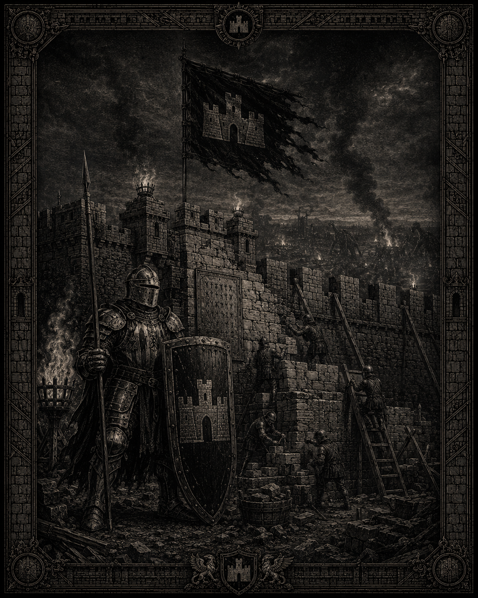

*Illustration d’Ostmur : le rempart des Gués et la résistance de l’infanterie lourde. Statut : draft — support visuel du duché et de son héraldique.*

**Duc** : Roland d’Ostmur, dit « le Mur » (58 ans).
**Blason** : rempart crénelé d’or sur fond noir.
**Spécialité** : infanterie lourde, piquiers de muraille.
**Menace** : Horde de la Dent, à trois jours depuis Fort-Guivre.
**Relation avec l’empereur** : loyauté totale, frère d’armes des Gués.

### Héraldique proposée

- **Champ** : sable noir.
- **Figure principale** : rempart crénelé d’or, représenté frontalement.
- **Détails** : trois tours carrées reliées par une muraille ; la tour centrale porte une petite ouverture noire.
- **Bordure** : étroite bordure d’acier ou d’argent.
- **Devise proposée** : « Nous ne cédons pas. »

L’or représente la richesse défendue par la forteresse. Le noir rappelle les sièges, la terre brûlée et les nuits passées sous les armes.

### Composant marquant

Le rempart des Gués est une fortification avancée protégeant les routes du Sud. Ses pierres portent les marques des réparations successives et les noms des défenseurs tombés.

### Directive d’illustration — *Le rempart des Gués*

**Mise en scène** : au premier plan, un fantassin lourd se tient devant un rempart crénelé, une pique plantée dans le sol et un bouclier devant lui. Sa silhouette compacte est protégée par une armure épaisse marquée par les combats. Derrière lui, le rempart traverse toute la composition ; les créneaux, éclairés par des torches, sont occupés par des soldats immobiles. Au-delà se distinguent une plaine sombre et les fumées d’un camp ennemi.

**Héraldique visible** : une grande bannière noire portant un rempart d’or ; le même motif gravé sur le bouclier ; les trois tours du blason reprises dans l’architecture réelle.

**Fait marquant** : une brèche réparée rappelle les attaques de la Horde de la Dent. Les pierres remplacées sont plus claires que le reste de la muraille.

## 2. Carvence — Marches du Piémont (front Sud)

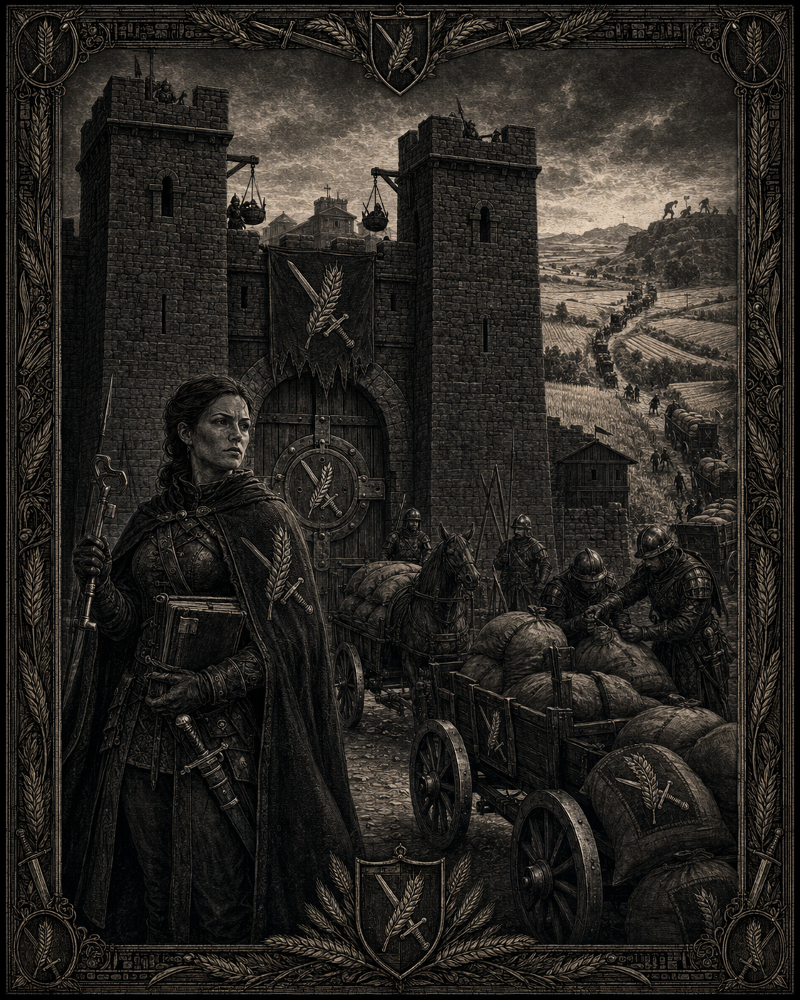

*Illustration de Carvence : les greniers fortifiés et les convois du Sud. Statut : draft — support visuel du duché et de son héraldique.*

**Duchesse** : Isabeau de Carvence (26 ans), héritière depuis la mort de son père à Fort-Guivre.
**Blason** : épi et épée croisés, argent sur fond vert.
**Spécialité** : escortes de convois, grenier du Sud.
**Menace** : raids gobelins sur les convois.

### Héraldique proposée

- **Champ** : vert profond.
- **Figures** : un épi d’argent croisé avec une épée droite.
- **Disposition** : l’épi orienté vers le haut, l’épée vers le bas, leurs axes formant une croix oblique.
- **Détails** : quatre grains d’or sur l’épi.
- **Devise proposée** : « Nourrir, puis défendre. »

Le vert évoque les terres cultivées. L’argent associe la récolte à une obligation militaire : le grenier du Sud doit pouvoir se défendre.

### Composant marquant

Les Greniers de Carvence forment un réseau de magasins fortifiés reliés aux routes militaires. Leur contrôle donne au duché une influence considérable sur les convois du front.

### Directive d’illustration — *Les Greniers du Sud*

**Mise en scène** : une duchesse ou commandante en armure légère se tient devant des greniers fortifiés. Elle porte une épée courte et tient un registre ou une clef de stockage, tandis qu’une colonne de chariots protégés quitte la porte. Au premier plan, des soldats escortent des sacs de grain. Au loin, des silhouettes gobelines observent depuis une crête.

**Héraldique visible** : un épi d’argent croisé avec une épée sur une bannière verte ; le motif répété sur les caparaçons des chevaux ; l’épi gravé sur la porte des greniers.

**Fait marquant** : le duché apparaît comme le grenier du front : la récolte n’est pas seulement une richesse, mais une ressource militaire constamment menacée.

## 3. Hautvent — Marches du Piémont (front Sud)

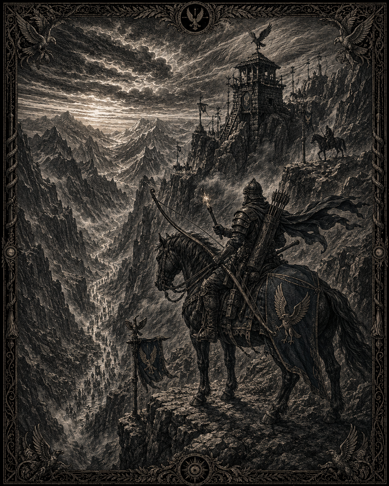

*Illustration de Hautvent : les archers montés surveillant les cols. Statut : draft — support visuel du duché et de son héraldique.*

**Duc** : Thibaut de Hautvent (44 ans), cavalier à la langue acérée.
**Blason** : faucon de bronze sur fond bleu.
**Spécialité** : archers montés, raids préventifs par les cols en terre orque.
**Menace** : représailles de la Horde.

### Héraldique proposée

- **Champ** : bleu profond.
- **Figure principale** : faucon de bronze en vol descendant.
- **Détails** : ailes ouvertes, serres visibles, tête tournée vers la gauche héraldique.
- **Éléments secondaires** : trois traits argentés évoquant le vent ou les cols.
- **Devise proposée** : « Voir avant de frapper. »

Le bronze distingue Hautvent des maisons plus anciennes utilisant l’or ou l’argent. Il rappelle les armes, les selles et les équipements des archers montés.

### Composant marquant

Les cols de Hautvent sont des passages élevés surveillés par des tours de guet. Les archers y utilisent le vent et la pente pour frapper avant tout contact direct.

### Directive d’illustration — *Les archers des cols*

**Mise en scène** : un archer monté domine un col rocheux depuis une corniche. Son cheval est placé de profil, légèrement incliné par le vent. Plusieurs archers apparaissent en profondeur, presque confondus avec les rochers. Des nuages rapides traversent le ciel et les bannières sont tendues horizontalement par les rafales.

**Héraldique visible** : un faucon de bronze sur fond bleu ; un faucon sculpté au sommet d’une tour de guet ; des plumes de bronze fixées aux hampes des archers.

**Fait marquant** : une volée de flèches descend vers un groupe ennemi invisible dans la vallée. Le duché est défini par sa capacité à frapper avant que l’adversaire n’atteigne les cols.

## 4. Aubemont — Val des Pèlerins (front Est)

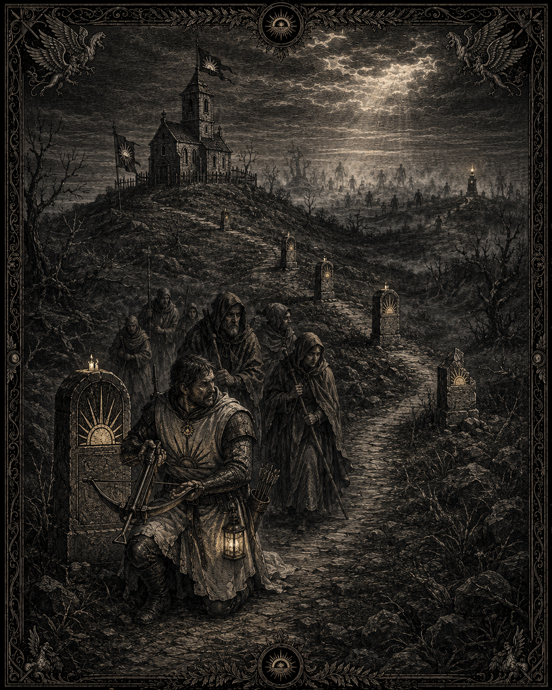

*Illustration d’Aubemont : la route des pèlerins et les bornes de veille. Statut : draft — support visuel du duché et de son héraldique.*

**Duc** : Clément d’Aubemont (61 ans), pieux, lettré et goutteux.
**Blason** : demi-soleil d’or sur fond blanc.
**Spécialité** : escortes de pèlerinage, arbalétriers de chapelle.
**Menace** : routes de pèlerinage coupées par les morts des Champs-Dolents.

### Héraldique proposée

- **Champ** : blanc ou argent très clair.
- **Figure principale** : demi-soleil d’or surgissant de la partie inférieure de l’écu.
- **Détails** : sept rayons visibles ; un chemin noir ou doré mène vers le soleil.
- **Bordure** : fine bordure blanche perlée ou dorée.
- **Devise proposée** : « La route mène à la lumière. »

L’héraldique est volontairement lumineuse, mais le chemin sombre rappelle les dangers des routes de pèlerinage.

### Composant marquant

La Route des Sept Bornes est un chemin sacré jalonné de pierres gravées et de chapelles fortifiées. Chaque borne correspond à une étape reconnue par les pèlerins.

### Directive d’illustration — *La Route des Sept Bornes*

**Mise en scène** : un groupe de pèlerins avance sur une route sombre entre deux bornes de pierre. Au premier plan, un arbalétrier de chapelle protège le passage, agenouillé près d’une lanterne. La route disparaît vers une chapelle fortifiée située sur une hauteur. Des silhouettes mortes ou des formes indistinctes apparaissent au bord des Champs-Dolents, sans devenir le sujet principal.

**Héraldique visible** : un demi-soleil d’or sur des bannières blanches ; les rayons du soleil repris sur les lanternes ; le motif gravé sur les bornes.

**Fait marquant** : la dernière borne est brisée et porte des traces de combat. Malgré cela, la lanterne qui la surmonte reste allumée.

## 5. Valombre — Champs-Dolents (front Est)

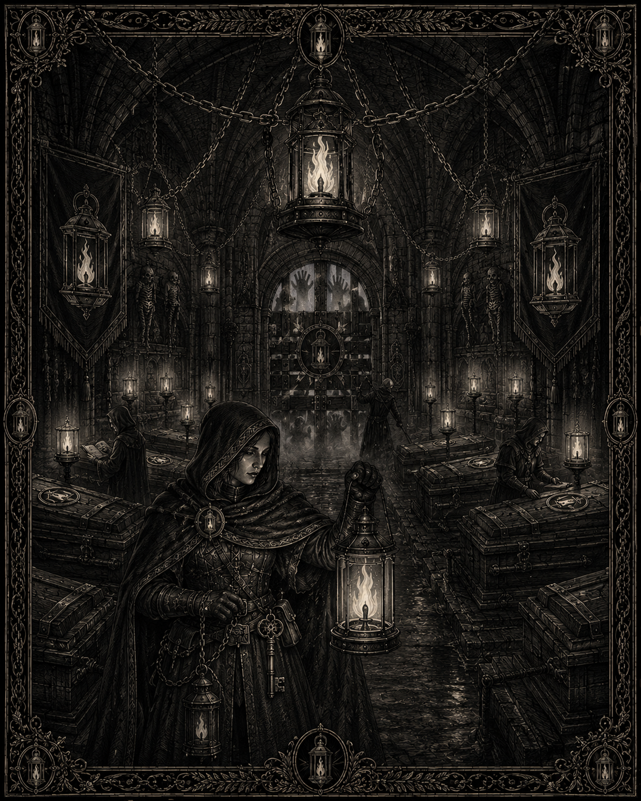

*Illustration de Valombre : la Maison de Veille et ses lanternes contre les morts. Statut : draft — support visuel du duché et de son héraldique.*

**Duchesse** : Mathilde de Valombre (49 ans), veuve, froide et respectée.
**Blason** : lanterne d’argent sur fond violet sombre.
**Spécialité** : guerre contre les morts, coordination avec le Linceul et les Torches.
**Menace** : les Veilles et le Cercle du Ver.

### Héraldique proposée

- **Champ** : violet sombre.
- **Figure principale** : lanterne d’argent suspendue à un crochet noir.
- **Lumière** : flamme blanche ou bleu pâle.
- **Détails** : trois petites chaînes sous la lanterne, évoquant les veilles funéraires.
- **Devise proposée** : « Tant qu’une lampe veille, nul mort ne marche seul. »

Le violet exprime le deuil et la dignité. La lumière ne symbolise pas la victoire, mais la vigilance contre les morts.

### Composant marquant

Les Maisons de Veille sont des fortins funéraires où les morts sont surveillés avant l’inhumation. Elles servent également de postes de coordination avec les unités spécialisées.

### Directive d’illustration — *La Maison de Veille*

**Mise en scène** : une gardienne en manteau sombre tient une lanterne d’argent dans une salle funéraire. Des cercueils fermés ou des corps enveloppés sont alignés derrière elle. Une seconde rangée de veilleurs observe les portes barricadées. Au fond, une ouverture laisse voir un paysage nocturne où errent des silhouettes mortes.

**Héraldique visible** : une lanterne d’argent sur champ violet ; le symbole suspendu au-dessus de la porte ; de petites lanternes identiques disposées autour des cercueils.

**Fait marquant** : une seule flamme éclaire la scène. Elle symbolise la surveillance des morts plutôt qu’une victoire sur eux.

## 6. Sernes — Marais des Roseaux (front Est)

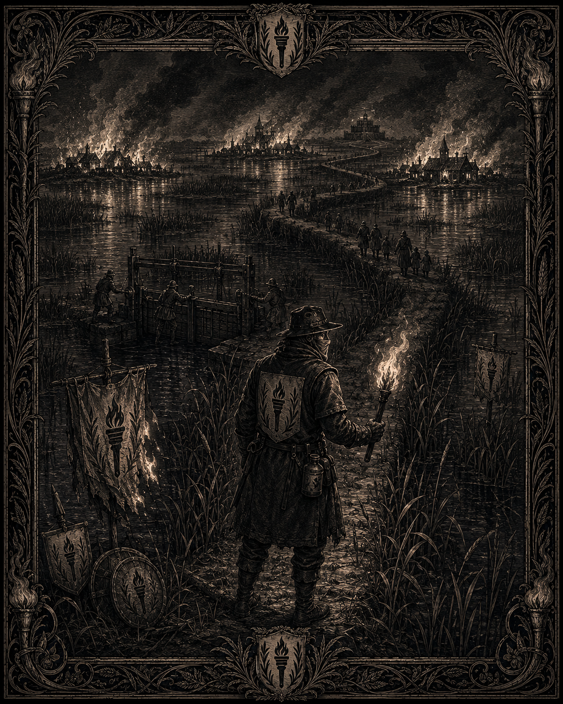

*Illustration de Sernes : les chaussées de roseaux et les brûleurs des marais. Statut : draft — support visuel du duché et de son héraldique.*

**Duc** : Baudouin de Sernes, dit « le Sec » (55 ans).
**Blason** : torche noire sur fond or.
**Spécialité** : guides des marais, brûleurs — a incendié trois villages contaminés en 2599.
**Menace** : la cour du Roi des Roseaux.

### Héraldique proposée

- **Champ** : or sombre.
- **Figure principale** : torche noire dressée verticalement.
- **Flamme** : rouge profond, presque sans détail.
- **Partie basse** : trois roseaux noirs sortant d’une eau vert sombre.
- **Devise proposée** : « Ce qui brûle ne revient pas. »

L’or rappelle le feu qui éclaire les marais, tandis que le noir de la torche évoque les méthodes radicales du duché.

### Composant marquant

Les Chaussées de Roseaux sont des digues étroites traversant les marais. Elles servent à la fois de routes, de lignes défensives et de pièges pour les envahisseurs.

### Directive d’illustration — *Les Chaussées de Roseaux*

**Mise en scène** : un brûleur de marais se tient sur une digue étroite, torche noire à la main. Derrière lui, des flammes avancent sur une zone de roseaux contaminés. Des silhouettes de soldats transportent des jarres d’huile. L’eau sombre reflète les incendies et brouille la séparation entre terre et marécage.

**Héraldique visible** : une torche noire sur champ d’or ; des roseaux noirs stylisés au bas des bannières ; la torche reproduite sur les boucliers des brûleurs.

**Fait marquant** : au loin, trois villages incendiés apparaissent sous forme de silhouettes fumantes. La scène suggère la brutalité de la décision sans montrer de violence gratuite.

## 7. Port-Maréal — Côte du Sel (Ouest)

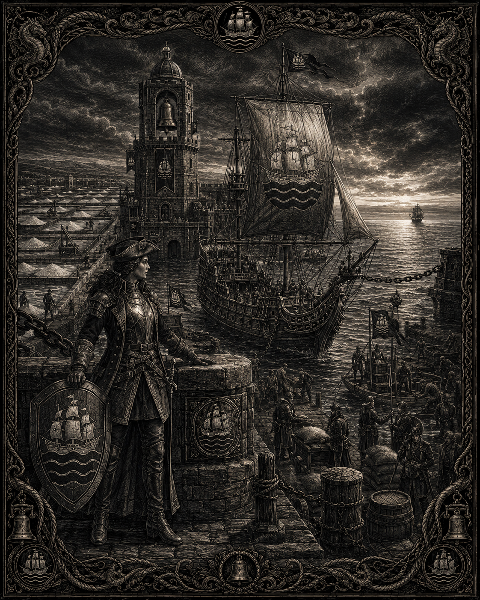

*Illustration de Port-Maréal : les salines, le port et les marins-soldats. Statut : draft — support visuel du duché et de son héraldique.*

**Duchesse** : Ysoline de Maréal (52 ans), armatrice, la plus riche des Quatorze.
**Blason** : nef d’argent sur fond bleu-vert ondé.
**Spécialité** : marins-soldats, commerce maritime.
**Menace** : piraterie et contrebande renégate par mer.

### Héraldique proposée

- **Champ** : bleu-vert ondé.
- **Figure principale** : nef d’argent à trois mâts.
- **Voiles** : blanches, marquées d’un petit disque doré.
- **Détails** : une ligne de sel blanche sous la coque.
- **Devise proposée** : « Par mer, par sel, par fortune. »

Le bleu-vert représente la mer côtière. L’argent renvoie aux navires et aux échanges, tandis que le sel constitue la richesse fondamentale du duché.

### Composant marquant

Les Salines de Maréal sont des bassins côtiers protégés par des digues et des tours. Elles sont à la fois une ressource économique et une cible régulière de la contrebande.

### Directive d’illustration — *Les Salines*

**Mise en scène** : une commandante maritime se tient sur une digue face à une nef d’argent. Elle porte une cape lourde, un sabre naval et un mantelet décoré de vagues. Des marins-soldats chargent des sacs de sel et surveillent l’horizon. Au large, une petite voile sombre évoque la piraterie ou la contrebande.

**Héraldique visible** : une nef d’argent sur champ bleu-vert ; le motif sur les voiles ; une ligne de sel blanche gravée sur la digue.

**Fait marquant** : une chaîne portuaire est abaissée pour laisser entrer la nef tandis qu’une seconde chaîne reste tendue vers la mer, signalant la double fonction commerciale et militaire du port.

## 8. Bellerive — Val de Sérande (Centre)

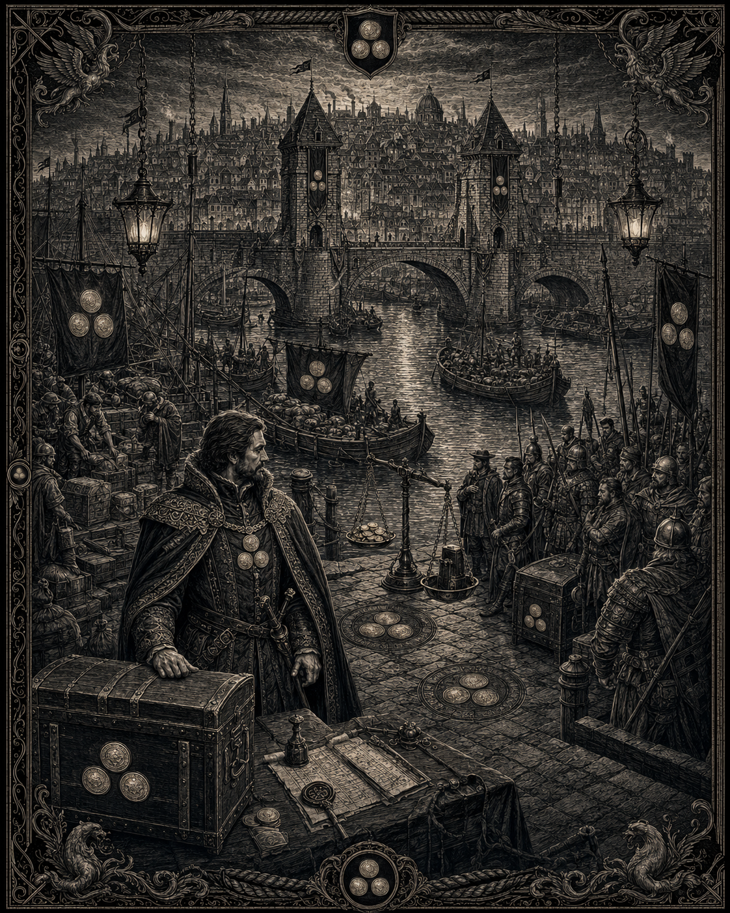

*Illustration de Bellerive : le Trésor des Trois Quais, ses compagnies fluviales et l’or qui paie les mercenaires. Statut : draft — support visuel du duché et de son héraldique ; l’image ne canonise pas les détails architecturaux, militaires ou commerciaux représentés.*

**Duc** : Amaury de Bellerive (47 ans), beau-frère de l’empereur, banquier des Quatorze.
**Blason** : trois besants d’or disposés en triangle sur fond vert.
**Spécialité** : compagnies fluviales, l’or qui paie les mercenaires.
**Menace** : pirates fluviaux et tentation des Clefs.

### Héraldique proposée

- **Champ** : vert de rivière.
- **Figures principales** : trois besants d’or disposés en triangle.
- **Détails** : une fine ligne ondée d’argent sous les besants.
- **Bordure** : or discret.
- **Devise proposée** : « Tout circule, tout se paie. »

Les trois besants représentent la monnaie, les péages et les trois grands axes fluviaux. Leur disposition triangulaire rappelle les réseaux financiers du duché.

### Composant marquant

Le Trésor des Trois Quais est un complexe de comptoirs et d’entrepôts installé au bord de la Sérande. Les mercenaires et les compagnies fluviales y négocient leurs contrats.

### Directive d’illustration — *Le Trésor des Trois Quais*

**Mise en scène** : un magistrat ou capitaine de convoi se tient sur un quai encombré de coffres, de contrats et de marchandises. Derrière lui, trois quais convergent vers un bâtiment financier fortifié. Des barges avancent sur la Sérande. Des mercenaires attendent leur solde près d’un coffre ouvert.

**Héraldique visible** : trois besants d’or disposés en triangle ; le motif peint sur les voiles des barges ; trois disques dorés incrustés dans le pavage du quai.

**Fait marquant** : une balance monétaire est placée entre les mercenaires et les marchands : l’argent de Bellerive transforme directement la richesse fluviale en puissance militaire.

## 9. Corvelle — Haute-Lisière (Forêts)

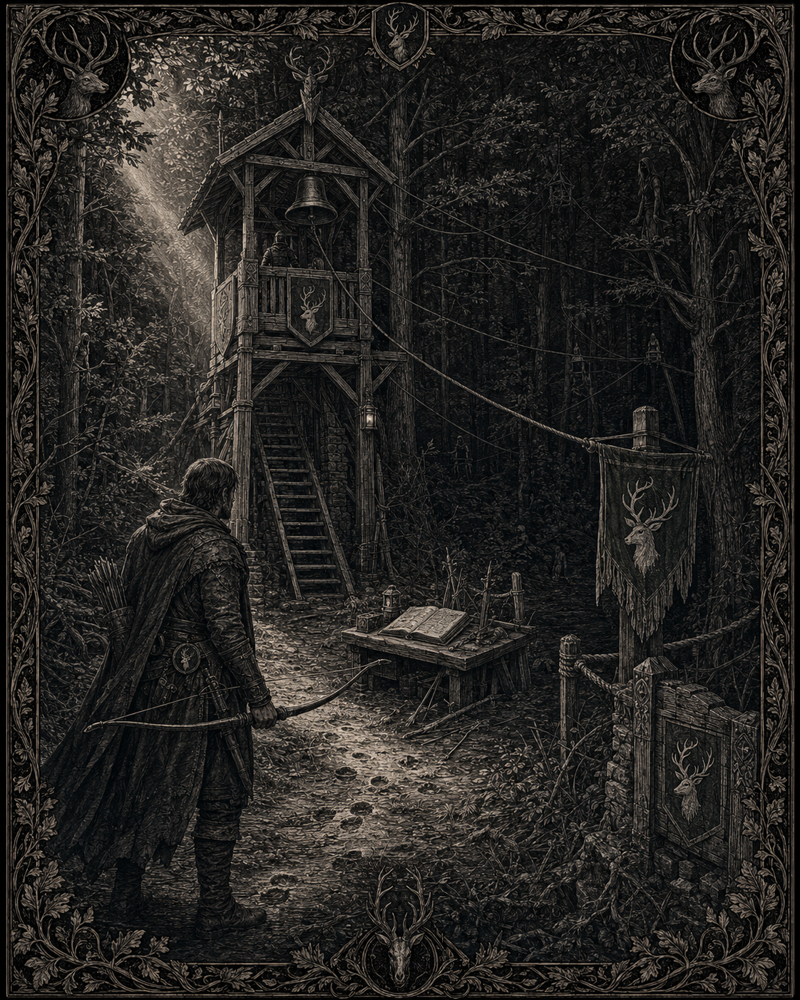

*Illustration de Corvelle : la Haute-Lisière et les postes forestiers. Statut : draft — support visuel du duché et de son héraldique.*

**Duc** : Renaud de Corvelle (39 ans), chasseur — son équipée de 2608 a tué un gardien elfe.
**Blason** : cerf d’argent sur fond vert sombre.
**Spécialité** : forestiers, archers d’affût.
**Menace** : Gardiens de l’Orée et Défeuillés.

### Héraldique proposée

- **Champ** : vert sombre.
- **Figure principale** : cerf d’argent tourné vers la gauche.
- **Détails** : bois ramifiés en sept pointes ; sous les sabots, une ligne de ronces noires.
- **Élément secondaire** : petite lune d’argent dans le canton supérieur.
- **Devise proposée** : « La forêt se souvient. »

Le cerf doit être noble mais inquiet, afin de rappeler que le duché est à la frontière d’un territoire elfique et qu’il n’en maîtrise pas réellement les équilibres.

### Composant marquant

La Haute-Lisière est une ligne de postes forestiers qui sépare les terres humaines des forêts. Chaque poste possède une cloche, une tour d’observation et un registre des incidents.

### Directive d’illustration — *La Haute-Lisière*

**Mise en scène** : un forestier armé d’un arc se tient sur un chemin bordé d’arbres. Derrière lui, un poste de guet humain surveille la lisière. Dans les branches et les brumes, des silhouettes elfiques restent volontairement ambiguës. Le forestier n’est pas en attaque : il sait qu’il est observé.

**Héraldique visible** : un cerf d’argent sur fond vert sombre ; les bois du cerf sculptés sur la tour de guet ; de petites plaques d’argent fixées aux arbres pour marquer la frontière.

**Fait marquant** : une cloche suspendue à la tour et un registre ouvert montrent le rôle de surveillance permanente de la Haute-Lisière.

## 10. Granmont — Piémont des Monts-Ferrés (Montagnes)

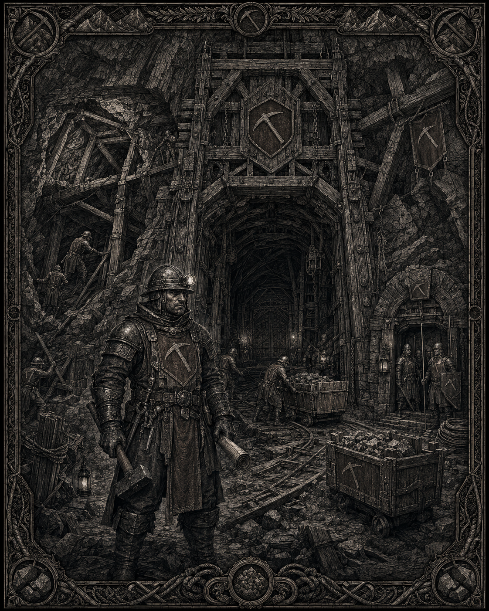

*Illustration de Granmont : la porte des galeries et la guerre souterraine. Statut : draft — support visuel du duché et de son héraldique.*

**Duc** : Hugues de Granmont (63 ans), seul humain que le roi Dorgan tolère à sa table.
**Blason** : pic de mineur d’argent sur fond brun.
**Spécialité** : sapeurs, guerre de tunnel.
**Relation particulière** : canal diplomatique officieux vers Hautroc.

### Héraldique proposée

- **Champ** : brun terre ou brun ferrugineux.
- **Figure principale** : pic de mineur d’argent posé en diagonale.
- **Figure secondaire** : petit fragment de montagne noire à la base.
- **Détails** : deux rivets d’or sur le manche du pic.
- **Devise proposée** : « La montagne donne, la pierre demeure. »

Le brun évoque la terre et les galeries. L’argent du pic représente le minerai extrait, tandis que le noir rappelle la profondeur des mines.

### Composant marquant

La Porte de Granmont est l’entrée fortifiée des grandes galeries. Elle abrite les ateliers de sapeurs, les réserves de métal et les négociations officieuses avec les nains.

### Directive d’illustration — *La Porte des Galeries*

**Mise en scène** : un maître sapeur se tient devant une immense porte de mine. Il porte un marteau ou un pic, une lanterne et une armure renforcée pour le travail souterrain. Derrière lui, des mineurs et des soldats travaillent autour de poutres de soutènement. Une seconde porte plus petite évoque un passage diplomatique vers les montagnes naines.

**Héraldique visible** : un pic d’argent sur fond brun ; le symbole gravé sur la porte de la mine ; deux pics croisés sur les tabards des sapeurs.

**Fait marquant** : une galerie effondrée est partiellement soutenue par des poutres neuves. La scène évoque à la fois l’exploitation minière et la guerre de tunnel.

## 11. Valcrène — Marches-Rompues (Nord, loyale)

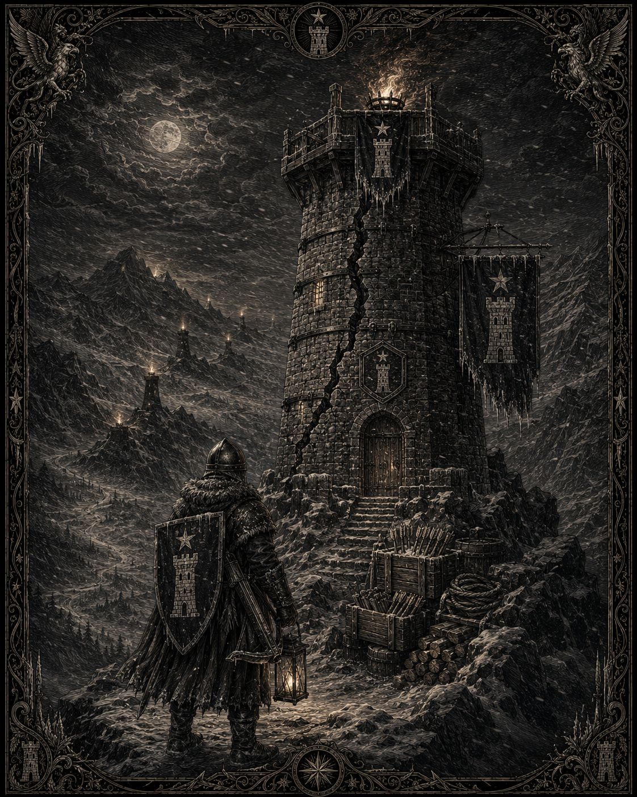

*Illustration de Valcrène : la tour de la veille dans les cols du Nord. Statut : draft — support visuel du duché et de son héraldique.*

**Duchesse** : Aliénor de Valcrène (57 ans), dure et économe de mots.
**Blason** : tour d’argent sous une étoile sur fond bleu nuit.
**Spécialité** : arbalétriers de montagne, garnisons d’hiver.
**Menace** : l’Ost des Délaissés dans ses propres cols. N’a jamais pardonné le Repli de 2597.

### Héraldique proposée

- **Champ** : bleu nuit.
- **Figure principale** : tour d’argent.
- **Figure secondaire** : étoile d’argent au-dessus de la tour.
- **Détails** : une fissure noire traverse la base de la tour sans la faire tomber.
- **Devise proposée** : « Tenir dans la nuit. »

La fissure rappelle le Repli de 2597 et la perte de confiance envers le pouvoir impérial. L’étoile représente la garnison qui continue de veiller malgré l’isolement.

### Composant marquant

La Tour de la Veille est une forteresse d’hiver construite sur un col. Ses feux de signalisation peuvent alerter simultanément plusieurs garnisons du Nord.

### Directive d’illustration — *La Tour de la Veille*

**Mise en scène** : une garnison d’hiver occupe une tour d’argent dressée sur un col enneigé. Au premier plan, une sentinelle enveloppée dans une cape tient une arbalète et observe la nuit. Au sommet, une étoile brillante sert de feu de signal. D’autres tours apparaissent au loin dans la neige.

**Héraldique visible** : une tour d’argent sous une étoile sur fond bleu nuit ; le même emblème sur le bouclier de la sentinelle ; l’étoile reproduite par les feux de signalisation.

**Fait marquant** : une fissure traverse la tour, mais elle a été consolidée par des cercles métalliques. Elle rappelle la fragilité du Nord et la mémoire du Repli de 2597.

## 12. Fervac — Marches-Rompues (Nord, loyauté surveillée)

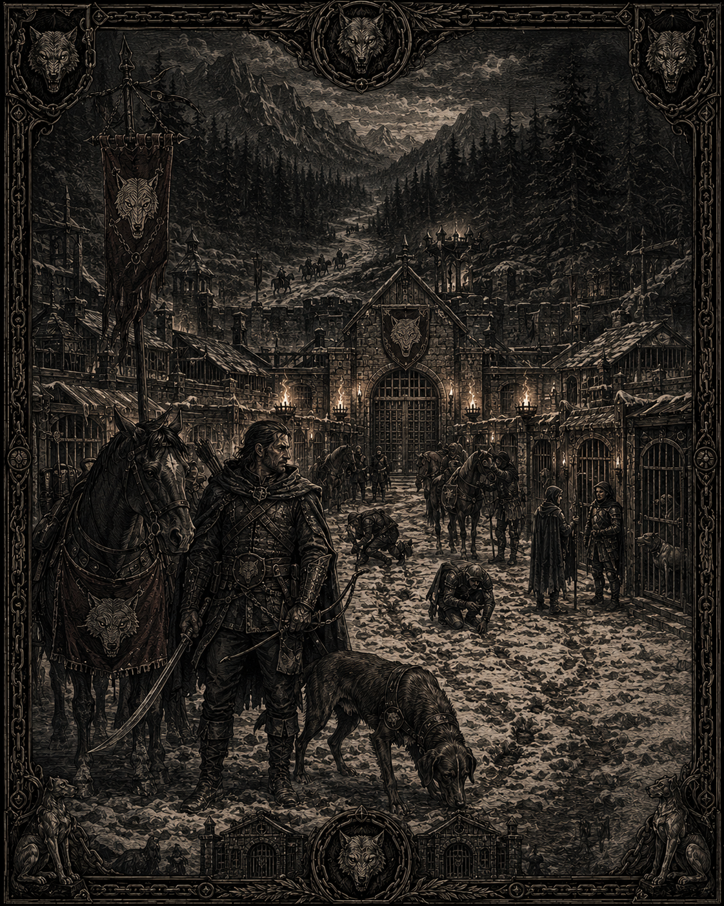

*Illustration de Fervac : les chenils de la traque et la cavalerie légère. Statut : draft — support visuel du duché et de son héraldique.*

**Duc** : Gauthier Fervac, dit « le Vieux Loup » (66 ans). Deux cousins siègent à la Ligue de Vercresse.
**Blason** : tête de loup grise sur fond rouge sombre.
**Spécialité** : cavalerie légère de traque.
**Statut politique** : jamais pris en faute, jamais tout à fait cru.

### Héraldique proposée

- **Champ** : rouge sombre.
- **Figure principale** : tête de loup grise.
- **Détails** : gueule légèrement ouverte, crocs visibles, regard tourné vers l’extérieur de l’écu.
- **Élément secondaire** : fine chaîne noire derrière la nuque.
- **Devise proposée** : « Veiller, flairer, survivre. »

Le loup exprime la traque et l’indépendance. La chaîne dissimulée suggère la loyauté surveillée du duché et ses liens ambigus avec le Nord.

### Composant marquant

Les Chenils de la Traque forment un réseau de relais pour cavalerie légère, chevaux de montagne et chiens de piste. Ils permettent de poursuivre les infiltrateurs dans les cols et les forêts froides.

### Directive d’illustration — *Les Chenils de la Traque*

**Mise en scène** : un cavalier léger se tient dans une cour froide, entouré de chiens de piste et de chevaux sellés. Il regarde vers une forêt où une piste disparaît sous la neige. Des éclaireurs suivent une ligne de poteaux et de traces. L’atmosphère est tendue, comme si la fidélité de tous les présents était incertaine.

**Héraldique visible** : une tête de loup grise sur fond rouge sombre ; l’emblème sur les caparaçons ; une tête de loup sculptée au-dessus de l’entrée des chenils.

**Fait marquant** : une chaîne noire est intégrée au cadre héraldique, mais presque dissimulée derrière le loup, rappelant la loyauté surveillée et l’ambiguïté politique de Fervac.

## 13. Brumeval — Marches-Rompues (Nord, verrou du Nord)

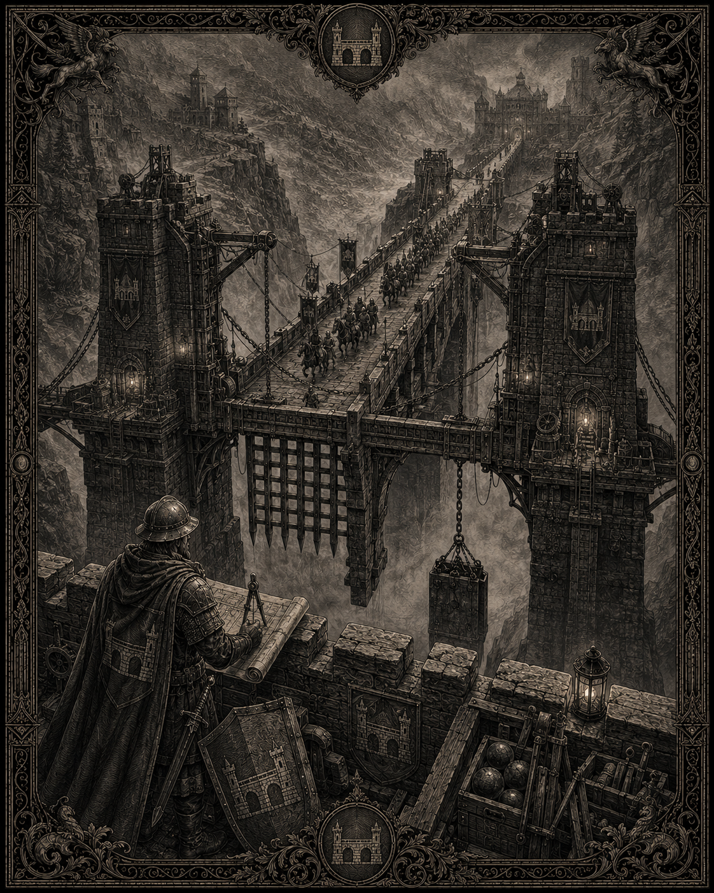

*Illustration de Brumeval : le Grand Pont et ses mécanismes de défense. Statut : draft — support visuel du duché et de son héraldique.*

**Duc** : Enguerrand de Brumeval (51 ans), ingénieur de formation, taciturne.
**Blason** : pont d’argent sur fond gris-vert.
**Ressource principale** : le Grand Pont, unique passage lourd vers le nord.
**Spécialité** : génie, fortification, artillerie à contrepoids.

### Héraldique proposée

- **Champ** : gris-vert brumeux.
- **Figure principale** : pont d’argent à trois arches.
- **Détails** : sous le pont, une ligne d’eau noire ; au-dessus, trois traits horizontaux représentant des tirs d’artillerie.
- **Bordure** : argent terni.
- **Devise proposée** : « Aucun passage sans prix. »

Le pont ne symbolise pas seulement une construction : il représente le contrôle du seul passage lourd vers le Nord.

### Composant marquant

Le Grand Pont est un ouvrage fortifié contrôlant la route septentrionale. Ses chambres internes abritent les contrepoids, les réserves de projectiles et les mécanismes permettant de fermer le passage.

### Directive d’illustration — *Le Grand Pont*

**Mise en scène** : un ingénieur en armure de campagne se tient sur le parapet du Grand Pont. Il tient un plan roulé dans une main et une épée courte dans l’autre. Le pont traverse une gorge brumeuse. Des machines à contrepoids, des chaînes et des herses sont visibles dans les tours. Une colonne militaire tente de franchir le passage sous surveillance.

**Héraldique visible** : un pont d’argent sur champ gris-vert ; le blason sculpté sur les tours ; les trois arches reprises dans la composition du cadre.

**Fait marquant** : le mécanisme de fermeture du pont est représenté à moitié armé : le passage peut encore être ouvert, mais il suffirait d’un signal pour le condamner.

---

## Cohérence visuelle de la série

> Statut : draft. Ces règles encadrent une série d’illustrations et ne canonisent aucun détail architectural, culturel, religieux, militaire ou physique non validé séparément.

Pour former un ensemble cohérent, les treize illustrations suivent les principes suivants :

- format vertical identique ;
- cadre gravé identique ;
- blason visible au moins deux fois dans chaque composition, en combinant si possible bannière, objet, architecture ou équipement ;
- personnage ou groupe principal au premier plan ;
- élément marquant placé au centre ou à l’arrière-plan ;
- palette secondaire adaptée à chaque duché, mais toujours assombrie par un traitement à l’encre ;
- aucun texte, nom ou devise inscrit dans l’image ;
- personnages génériques par défaut, sans identification visuelle définitive d’un duc ou d’une duchesse avant validation ultérieure.

### Cohérence héraldique proposée

Les treize blasons formeraient une hiérarchie visuelle cohérente :

- **Sud** : noir, vert et bleu — forteresse, récolte, mobilité ;
- **Est** : blanc, violet, or et noir — lumière, deuil, feu ;
- **Ouest et Centre** : bleu-vert, vert et or — commerce, rivière, richesse ;
- **Forêts et montagnes** : vert sombre et brun — frontières naturelles et ressources ;
- **Nord** : bleu nuit, rouge sombre et gris-vert — surveillance, ambiguïté, verrou militaire.

Les éléments les plus directement établis par le corpus sont conservés : rempart d’Ostmur ; épi et épée de Carvence ; faucon de Hautvent ; demi-soleil d’Aubemont ; lanterne de Valombre ; torche de Sernes ; nef de Port-Maréal ; trois besants de Bellerive ; cerf de Corvelle ; pic de Granmont ; tour et étoile de Valcrène ; loup de Fervac ; pont de Brumeval.

## Statut de l’ensemble

> Statut : draft.

Ces mises en scène développent les blasons et faits marquants déjà associés aux duchés, mais ne canonisent ni les devises, ni les détails architecturaux, ni les nouveaux personnages représentés. Les scènes impliquant des morts, des villages incendiés, des elfes ou des ennemis restent des propositions visuelles et ne fixent pas de faits supplémentaires au-delà des informations déjà présentes dans le corpus.

Les couleurs secondaires, devises, détails internes des écus et composants marquants décrits dans les sous-sections héraldiques sont des ajouts créatifs proposés. Aucune de ces précisions n’est canonique sans validation explicite.

## Tableau récapitulatif

| # | Ville | Duc/Duchesse | Blason | Front |
|---|---|---|---|---|
| 1 | Ostmur | Roland d'Ostmur | Rempart d'or / noir | Sud |
| 2 | Carvence | Isabeau de Carvence | Épi et épée / vert | Sud |
| 3 | Hautvent | Thibaut de Hautvent | Faucon bronze / bleu | Sud |
| 4 | Aubemont | Clément d'Aubemont | Demi-soleil d'or / blanc | Est |
| 5 | Valombre | Mathilde de Valombre | Lanterne d'argent / violet | Est |
| 6 | Sernes | Baudouin de Sernes | Torche noire / or | Est |
| 7 | Port-Maréal | Ysoline de Maréal | Nef d'argent / bleu-vert | Ouest |
| 8 | Bellerive | Amaury de Bellerive | Trois besants d'or / vert | Centre |
| 9 | Corvelle | Renaud de Corvelle | Cerf d'argent / vert sombre | Forêts |
| 10 | Granmont | Hugues de Granmont | Pic d'argent / brun | Montagnes |
| 11 | Valcrène | Aliénor de Valcrène | Tour et étoile / bleu nuit | Nord |
| 12 | Fervac | Gauthier Fervac | Tête de loup / rouge sombre | Nord |
| 13 | Brumeval | Enguerrand de Brumeval | Pont d'argent / gris-vert | Nord |
