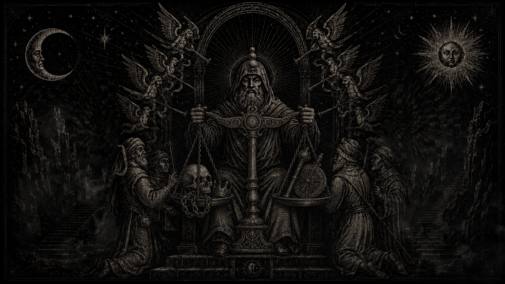

# Alexandre III, empereur

## Faits canoniques
> Statut : canon

Alexandre III est l'empereur actuel, souverain légitime, successeur de 2 609 ans de lignée. Il adore principalement Mitra. Il n'est ni un souverain parfaitement bon, ni un tyran.

## Identité proposée
> Statut : draft

Né 2555, second fils d'Aldemar IV. Couronné en 2588, à 33 ans. 54 ans en 2609, 21 ans de règne. Épouse Éliane de Bellerive, morte en 2603. Enfants : le prince héritier **Aldéric** (24 ans, front sud) et la princesse **Solène** (20 ans, Grande Lampe). Frère cadet : **prince Gaëtan** (49 ans), commandant de Tris. Connétable : **Odon Ferrant**, ancien maréchal du front sud, une jambe raide.

## Apparence
> Statut : draft

Grand, sec, dos droit. Cheveux gris coupés court, barbe taillée. Cicatrice à la main gauche, souvenir des Gués. Petite lampe d'argent de Mitra au cou. Manteau gris et blanc en audience ; la balance d'or n'apparaît qu'en cérémonie. Il déteste qu'on le peigne en armure dorée — les ateliers le font quand même.

*Représentation symbolique et cérémonielle associée à Alexandre III et à l’autorité impériale. Statut : draft — l’image ne valide pas automatiquement les détails physiques, vestimentaires, architecturaux ou religieux qu’elle représente.*

## Tempérament
> Statut : draft

Méthodique, économe de paroles, lent à trancher. Colères rares mais froides : il retire sa confiance, et elle ne revient presque jamais. Qualités : constance, courage physique, sens du devoir, piété sincère. Défauts : lenteur qui a coûté cher au Nord, rancune tenace, gouverne par l'arithmétique là où il faudrait de la chaleur.

## Décisions militaires majeures
> Statut : draft

- **Chevauchée des Gués (2584)** : gloire fondatrice — trois cents cavaliers forcent le blocus orque pour ravitailler Ostmur assiégée.
- **Repli du Nord (2597)** : faute la plus lourde. Pour renforcer les fronts sud et est, il retire des garnisons de cols du Nord. L'Ost des Délaissés naît de ce vide. Il ne s'est jamais excusé publiquement.
- **Refus du bûcher général (2599)** : interdit l'extension des méthodes de Sernes aux autres duchés de l'Est.

## Réputation
> Statut : draft

Le peuple des villes le respecte sans le chérir : le Vieux Fléau, juste et froid. Les frontaliers du Sud le vénèrent à cause des Gués. Le Nord le hait. La propagande le peint en cavalier éternel ; les renégats en usurier couronné pesant des os.

## Accroches narratives
> Statut : draft

1. Il cherche un agent discret pour surveiller Fervac.
2. Une pétition des veuves de Valcrène demande réparation pour le Repli.
3. La lampe d'argent d'Éliane : serait-elle une copie depuis un vol ?
4. Le prince Aldéric prend des risques insensés sur le front sud pour égaler son père.
