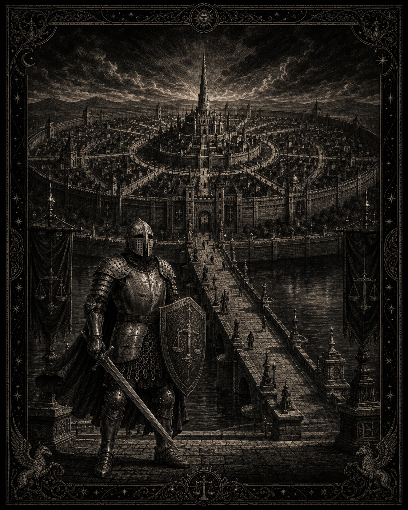

# L'armée impériale

*Représentation d’un soldat impérial de haut rang devant le pont de Tris. Statut : draft — l’illustration représente l’esthétique militaire, l’autorité impériale et la symbolique de la Balance ; elle ne définit pas un grade, une unité ou un personnage précis.*

## Principe : deux armées, une balance
> Statut : draft

- **Les osts ducaux** : levés et payés par chaque duc, aux armoiries ducales.
- **L'ost impérial** : recruté au nom d'Alexandre III, à la balance d'or sur fond noir.

## Tableau des grades
> Statut : draft

| Grade | Fonction | Subordonnés |
|---|---|---|
| Milicien | Défense locale | Aucun |
| Recrue | Soldat en formation | Aucun |
| Homme d'armes | Soldat professionnel | Aucun |
| Vintenier | Chef de file | ~20 hommes |
| Cinquantenier | Chef de section | ~50 hommes |
| Centenier | Chef de compagnie | ~100 hommes |
| Banneret | Chef de bannière | 300-600 hommes |
| Maréchal ducal | Commandant de l'ost d'un duché | Tout l'ost ducal |
| Maréchal de front | Commandant d'un front (Sud, Est ou Nord) | Tous les contingents du front |
| Connétable | Chef suprême sous l'empereur | Toute l'armée |

Connétable actuel : **Odon Ferrant**, ancien maréchal du front sud, une jambe raide.

## Branches
> Statut : draft

- **Infanterie de ligne** : le cœur. Lances, vouges, boucliers blasonnés.
- **Cavalerie** : rare et chère. Bannières lourdes, cavaliers légers de Hautvent.
- **Archers et arbalétriers**.
- **Ingénieurs d'ost** : ponts, sapes, machines de siège. Corps peu nombreux, très disputé.
- **Prévôts** : police de l'armée. Détestés, nécessaires.
- **Chirurgiens et soigneurs** : chirurgiens laïcs, sœurs de Mahra, prêtres de Mitra.
- **Spécialistes des morts-vivants** : huile, feu, consignes funéraires strictes.

## Frictions structurelles
> Statut : draft

- Les maréchaux ducaux obéissent aux maréchaux de front « pour la durée de la campagne ».
- Fervac fournit ses contingents en retard, jamais assez pour être accusé de trahison.
- Les Torches relèvent nominalement du Connétable mais suivent d'abord leurs propres vœux.
