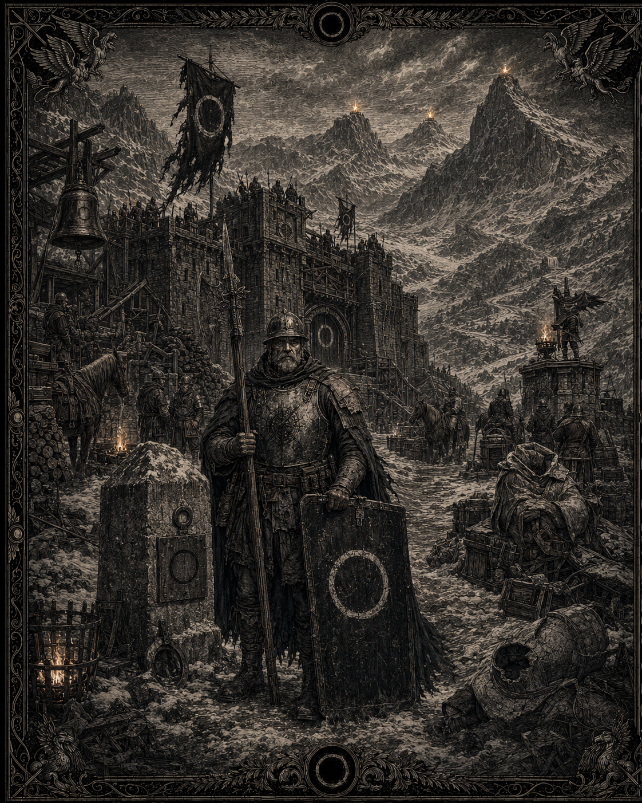
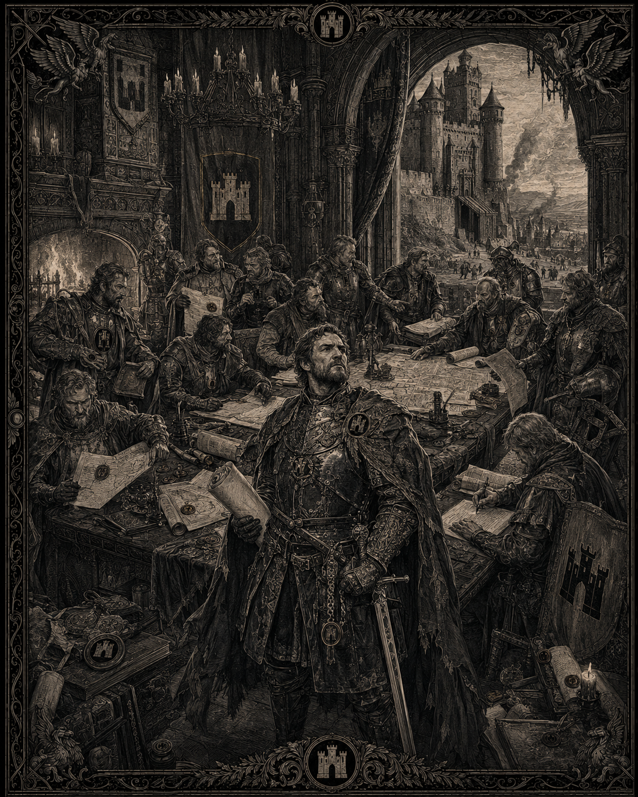
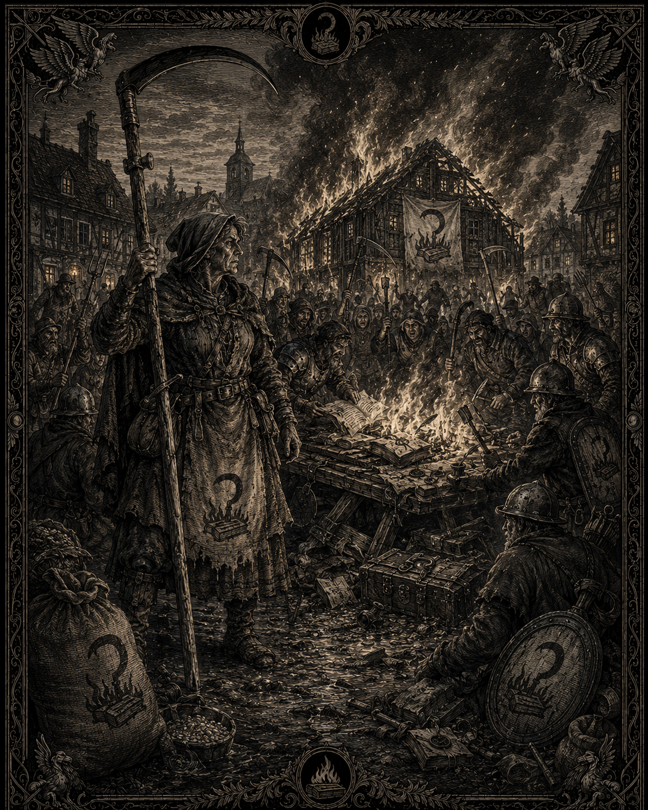
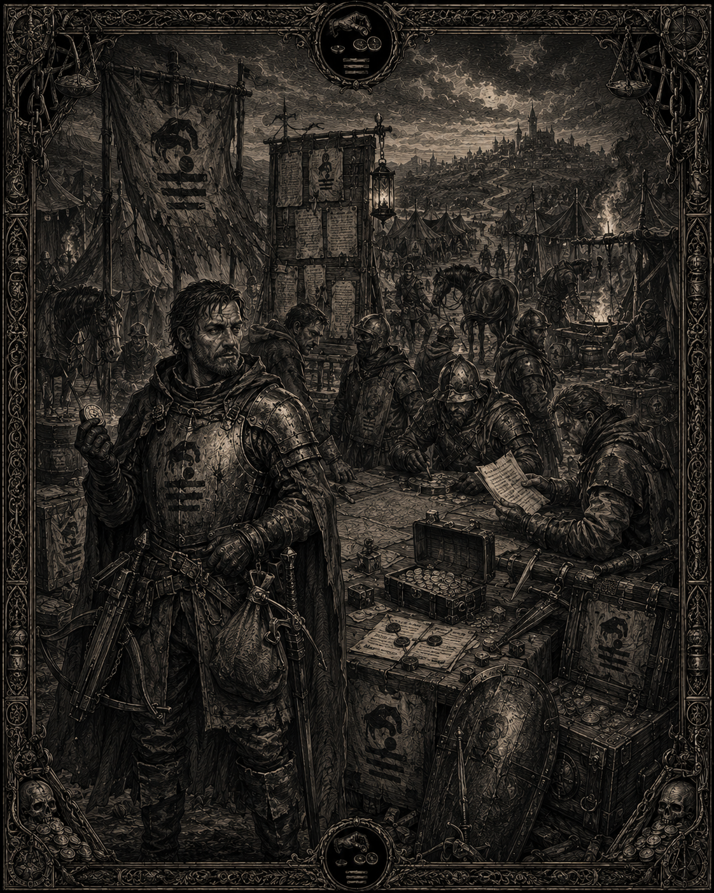
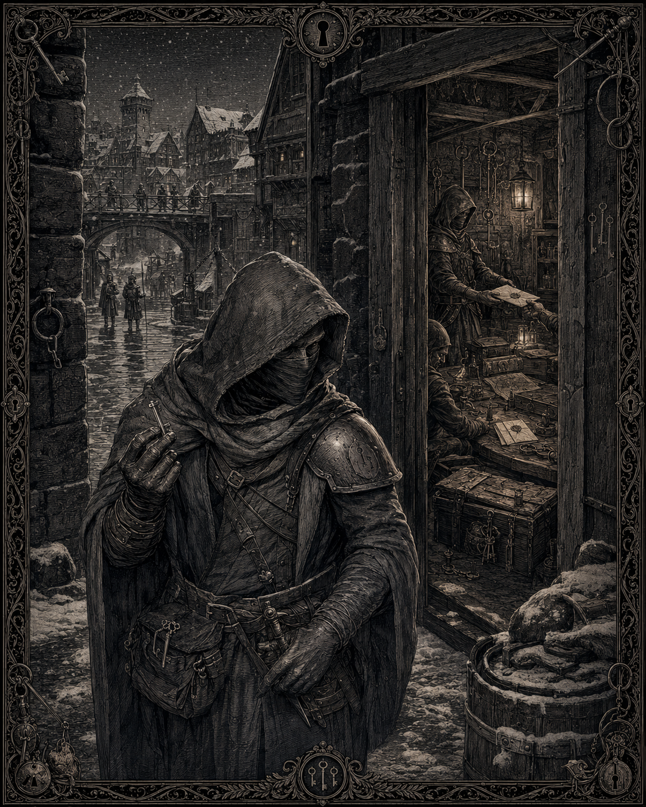
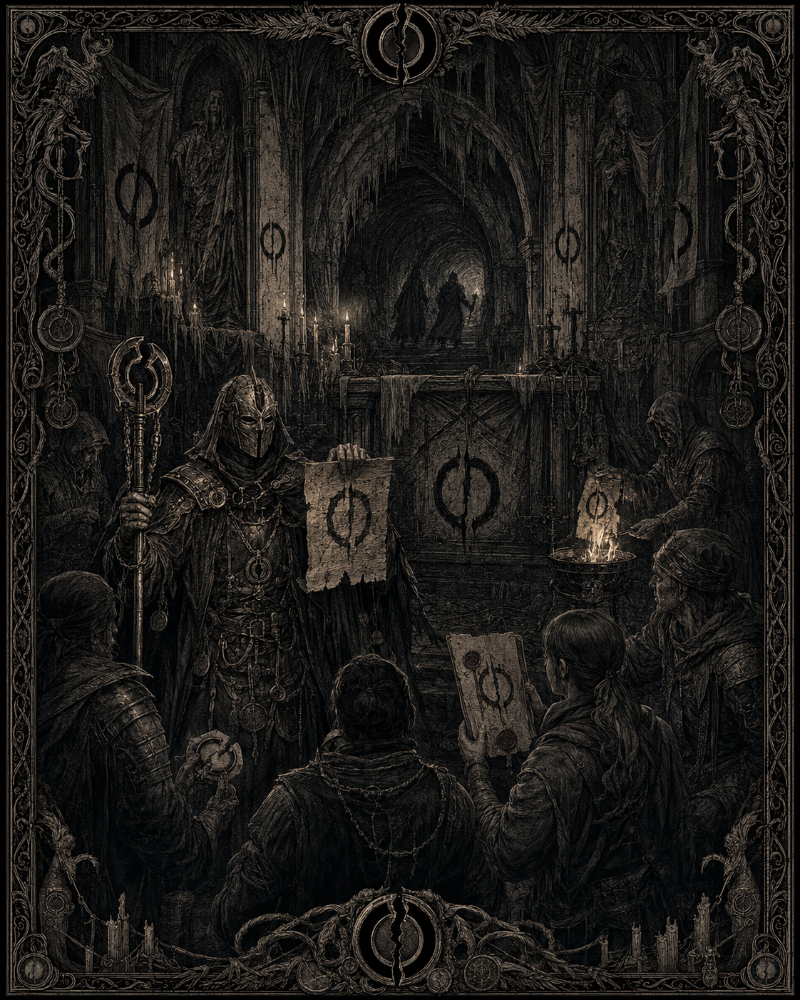

# Les renégats

## Canon
> Statut : canon

Attaquent principalement depuis le nord. Pas de faction unifiée. La majorité a abandonné les trois dieux humains ; seule une petite minorité adore les dieux noirs. Comprennent : une ancienne armée provinciale séparatiste, des nobles rebelles, des paysans insurgés, des mercenaires et déserteurs, une guilde de voleurs, et une branche corrompue par les dieux noirs.

## Les six forces
> Statut : draft

### 1. L'Ost des Délaissés — faction_forsaken_host

*Illustration de l’Ost des Délaissés : une garnison sans empereur, marquée par le Repli et le cercle vide. Statut : draft — support visuel de la faction ; l’image ne canonise pas les détails physiques, militaires ou architecturaux représentés.*
Garnisons abandonnées lors du Repli (2597), devenues soldats sans empereur. Tiennent trois cols saisis en 2598. Balance martelée, remplacée par un cercle vide au fer rouge. Chef : le « Maréchal sans nom ».

### 2. La Ligue de Vercresse — faction_vercresse_league

*Illustration de la Ligue de Vercresse : nobles rebelles, châteaux et prétentions juridiques. Statut : draft — support visuel de la faction ; l’image ne canonise pas les détails physiques, militaires ou architecturaux représentés.*
Coalition de nobles rebelles proclamée en 2601 autour d'**Aldran de Vercresse**, baron dépossédé. Châteaux, chartes, prétentions juridiques. Cousins de Fervac restés dans ses rangs.

### 3. Les Faucheux — faction_the_reapers

*Illustration des Faucheux : l’insurrection paysanne, les faux redressées et les registres fiscaux détruits. Statut : draft — support visuel de la faction ; l’image ne canonise pas les détails physiques, sociaux ou historiques représentés.*
Paysans insurgés armés de faux redressées. Figure fédératrice : « **la Mère aux Faux** ». Brûlent les registres fiscaux d'abord, les granges des collecteurs ensuite.

### 4. Les Sans-Solde — faction_the_unpaid

*Illustration des Sans-Solde : compagnies libres, mercenaires et déserteurs réunis autour de la paie. Statut : draft — support visuel de la faction ; l’image ne canonise pas les détails physiques, militaires ou contractuels représentés.*
Mercenaires et déserteurs en compagnies libres. Condottiere **Barral**. Doctrine unique : la paie.

### 5. Les Clefs — faction_the_keys

*Illustration des Clefs : contrebande, faux sceaux et renseignement vendu dans les ombres du Nord. Statut : draft — support visuel de la faction ; l’image ne canonise pas les détails physiques, urbains ou organisationnels représentés.*
Grande guilde de voleurs du Nord. Contrebande, faux sceaux, renseignement vendu à la Ligue.

### 6. Le Serment-Vide — faction_empty_oath

*Illustration du Serment-Vide : infiltration, faux prophètes et serments retournés sous l’influence d’Azura. Statut : draft — support visuel de la faction ; l’image ne résout pas le mystère religieux ni ne canonise les détails représentés.*
Culte d'Azura dirigé par « **le Parjure** ». Infiltration, faux prophètes, serments retournés. Les autres forces renégates le craignent et le nient.

## Religion des renégats
> Statut : draft

La plupart ont simplement cessé de prier. Les cultes noirs recrutent dans l'amertume du Repli, mais restent minoritaires et généralement haïs même au Nord.

## Esthétique
> Statut : draft

Équipement impérial réutilisé : armoiries martelées, repeintes, recouvertes. Cercle vide de l'Ost, faux croisées des Faucheux, gris sans marque des Clefs. Modulaire 3D : mêmes bases que l'Empire, textures dégradées, blasons recouverts.
