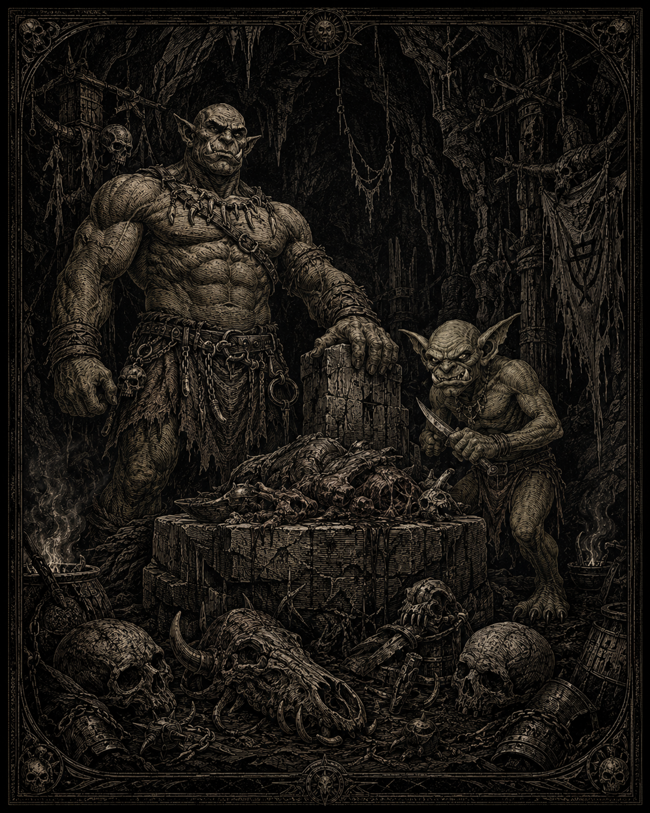

# Orques et gobelins

*Illustration d’une scène orque et gobeline. Statut : draft — représentation visuelle de la domination brutale de l’orc et de la servilité fourbe du gobelin ; l’image ne valide pas automatiquement les détails physiques, vestimentaires ou culturels représentés.*

## Canon
> Statut : canon

- Les orques attaquent principalement depuis le sud.
- Ils sont généralement bêtes. Ils vénèrent principalement la viande et la pierre. Les hordes se forment par domination du chef le plus brutal.
- Les gobelins sont petits, mauvais, trompeurs, ricanent comme des hyènes, craignent les orques (« grands frères »), vivent souvent auprès d'eux, parfois comme garde-manger vivant.

## Les orques
> Statut : draft

Ils viennent des terres de la Morsure, au sud des Monts-Ferrés, et d'au-delà. Leur direction : le nord, où il y a de la viande. Les hordes passent la chaîne par les cols et par la brèche de Karvedan, ouverte depuis 1043.

**Religion : la Viande et la Pierre.** Manger l'ennemi, c'est finir de le vaincre. La pierre est ce qui reste — la masse qui ne casse pas. Les prêtres, les **Mâche-os**, lisent l'avenir dans les fêlures des os chauffés.

**La Horde de la Dent** — faction_fang_horde : unifiée en 2605 par **Gharok Mange-Pierre**. A pris Fort-Guivre en 2607 par trois fausses retraites successives. Sa bannière : une mâchoire de bête hissée sur deux lances.

## Les gobelins
> Statut : draft

Petits, jaunâtres, tout en dents et en doigts. Ils ricanent — ce rire de hyène qui fait plus pour la terreur des sentinelles que bien des hurlements. Survivent en mentant, en cachant, en désignant un coupable d'avance. Vrais génies des pièges : fosses, collets, jarres de guêpes, planchers sciés.

Figure connue des rapports impériaux : **Grelot**, gobelin au bonnet de clochettes, vendu le même col aux deux camps trois fois. Capturé deux fois. Évadé deux fois. Les soldats du front sud en parlent presque avec affection.

## Utilisation en jeu
> Statut : draft

- Orques : brutes de mêlée, chefs comme mini-boss, narration environnementale (totems, viande séchée).
- Gobelins : harcèlement, pièges, tunnels. PNJ marchand de butin douteux ou prisonnier bavard.
- Butin : armes grossières, fétiches d'os, butin humain volé — et sur les gobelins, des objets minuscules souvent clef d'une quête.
