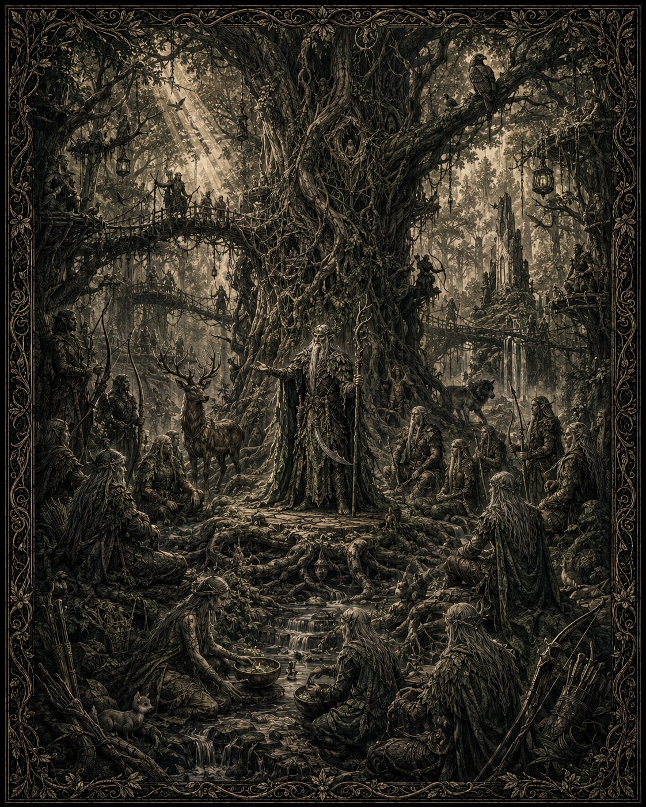
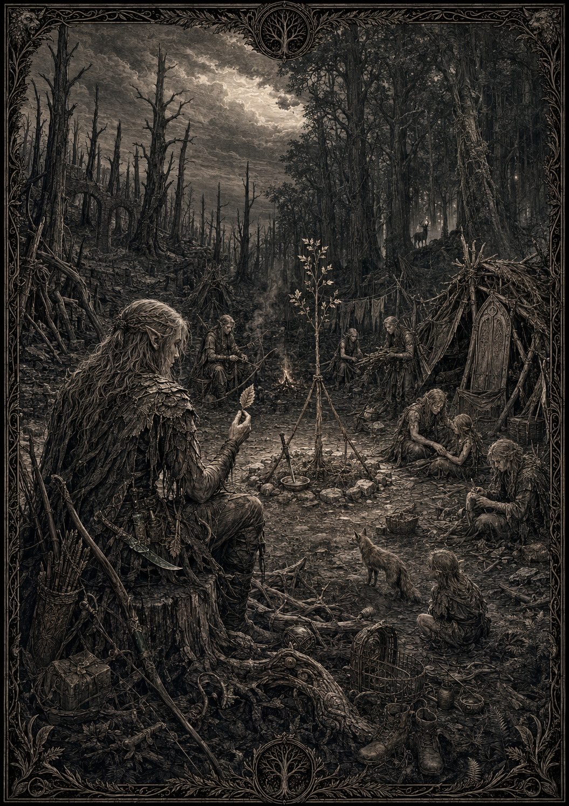
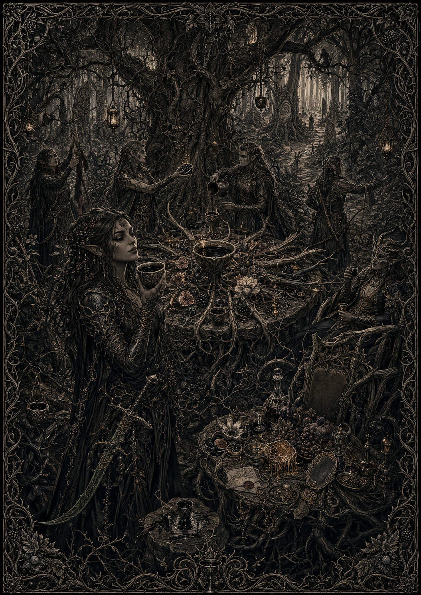

# Les elfes des forêts

*Illustration des elfes des forêts : une communauté liée aux arbres, aux animaux et au Chant. Statut : draft — support visuel du peuple elfe ; aucune héraldique ni aucun détail physique, culturel ou architectural non validé n’est canonisé.*

## Canon
> Statut : canon

- Vivent dans de grandes forêts, vénèrent la nature, très proches des animaux. Pas entièrement pacifiques.
- Des elfes renégats existent ; une minorité adore les dieux noirs.
- En guerre contre orques, gobelins, morts-vivants, nécromanciens.
- Haine ancienne et sérieuse envers les nains.
- Officiellement neutres avec l'Empire.

## Territoire
> Statut : draft

Cœur : la forêt d'Ambrevaille (ouest). D'autres bois, dispersés sur tout le continent — du nord aux abords du Levant —, abritent des clans mineurs. Pour un elfe, la forêt n'est pas un décor : c'est un corps dont il est une main.

## Structure politique
> Statut : draft

- **Le Concile des Ramures** : l'autorité des grandes familles. Voix dominante : l'**Aînée Séliane**, qui a connu la chute de Karvedan et n'en parle jamais.
- **Les Gardiens de l'Orée** : les radicaux de lisière. Cheffe : **Sévrane l'Épine**.
- **Les Défeuillés** : exilés et brisés ; la plupart des humains ne voient un elfe que sous leurs traits, d'où bien des malentendus.

  

  *Illustration des Défeuillés : des elfes exilés vivant parmi les traces d’une forêt perdue. Statut : draft — support visuel de la faction ; aucun détail physique, culturel ou historique non validé n’est canonisé.*
- **Les Ronces** : minorité liée aux dieux noirs, surtout Atara. Traqués durement par les autres elfes.

  

  *Illustration des Ronces : un culte elfique lié aux dieux noirs et à la sève, dans une clairière envahie par les ronces. Statut : draft — support visuel de la faction ; l’image ne canonise pas les détails religieux, physiques ou architecturaux représentés.*

## La haine des nains
> Statut : draft (cause à valider — voir 31_OPEN_QUESTIONS)

**La Dette d'Écorce (944)** : effondrement minier nain sous la lisière sud d'Ambrevaille — là où la forêt touche les Monts-Ferrés — tue l'Arbre-Mère d'un clan. Les nains paient en or ; les elfes n'ont jamais touché l'or, qui rouille dans une clairière.

**La Trahison des Ombrages (1002)** : lors d'une invasion orque, le Concile refuse passage à une colonne naine. Version naine : rancune de la Dette ; version elfique : la colonne portait des haches de bûcheronnage. Karvedan tombe en 1043. Sylvelane ferme ses portes en 1051.

## Religion
> Statut : draft

### Faits marquants proposés

- Les Défeuillés pourraient conserver des fragments d’écorce provenant de leurs anciennes forêts et planter une graine au centre de chaque camp.
- Les Ronces pourraient greffer des ronces sur d’anciens arbres sacrés et transformer ces lieux de mémoire en clairières de banquet liées à Atara.
- Les marques naturelles laissées par les elfes — feuilles, fougères, entailles dans l’écorce — ne constitueraient pas une héraldique commune.

Pas de dieux au sens humain : des Aînés — arbres-mères, bêtes premières, rivières nommées — et le Chant. Blasphème elfe : couper sans rendre, tuer sans manger, bâtir sans demander.

## Esthétique
> Statut : draft

Arcs longs, lames courbes bronze-vert, cuirs teints, écorce durcie. Couleurs : verts profonds, bruns, gris de brume. Motif : spirale de fougère. Modulaire 3D : silhouettes humaines élancées, sur-pièces d'écorce sur base cuir.
