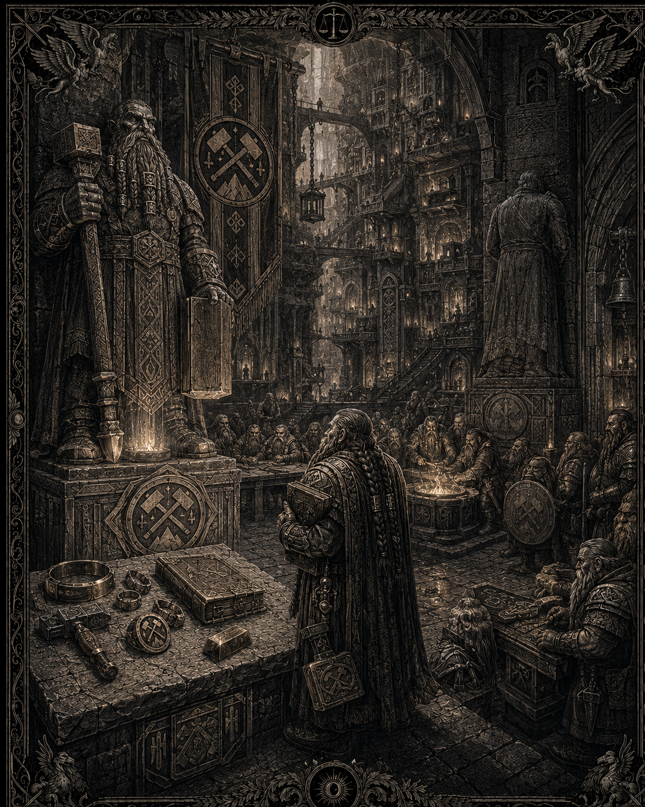

# Les nains des montagnes

*Illustration des nains des montagnes : forteresses souterraines, mémoire des Aînés et puissance de la pierre. Statut : draft — support visuel du peuple nain ; l’image ne canonise pas l’héraldique proposée ni les détails physiques, culturels ou architecturaux représentés.*

## Canon
> Statut : canon

- Les nains vivent dans les montagnes du sud et des forteresses souterraines, juste au-dessus des terres orques : premier rempart entre la Morsure et l'Empire.
- Tous reconnaissent un seul roi au tempérament explosif.
- Ils vénèrent des statues (ancêtres, valeurs) — pas nécessairement des dieux vivants.
- En guerre contre orques, gobelins, morts-vivants. Détestent les elfes. Neutres avec l'Empire.

## Territoire
> Statut : draft

Les Monts-Ferrés, la grande chaîne du sud. Capitale : **Hautroc**, forteresse-cité creusée sur neuf niveaux. Et la plaie ouverte : **Karvedan**, tombée en 1043, sa chute ayant ouvert dans la chaîne la brèche par où les hordes passent vers l'Empire.

## Le roi
> Statut : draft

**Dorgan Cœur-de-Forge**, soixante-dix ans (jeune pour un roi nain). Son tempérament est un fait diplomatique : il hurle, casse des tables de conseil, a jeté un émissaire dans le Puits des Aînés (sur filet, tout de même). Mais sa colère n'est jamais gratuite ; il n'a jamais rompu un serment scellé — c'est pourquoi il en scelle si peu. Porte au flanc la cicatrice d'un croc de tunnel.

## Les Aînés de pierre
> Statut : draft

Dans chaque salle commune, des statues : fondateurs de lignée, premiers piocheurs, guerriers, figures de valeurs (la Dette, la Parole, la Veille). On ne les prie pas comme des dieux : on leur *rend compte*. Un clan déshonoré voit sa statue tournée face au mur — le Retournement, peine suprême du droit nain.

## Dettes et serments
> Statut : draft

Le droit nain : ce qu'on doit, ce qu'on a juré. Tout se compte, tout se rend. La dette envers les elfes est *payée* selon le droit nain — d'où l'incompréhension avec des elfes qui refusent de la tenir pour soldée. Aucun nain ne présentera d'excuses pour une dette réglée.

## Rapport à l'Empire
> Statut : draft

Neutralité marchande et bourrue. Le canal de Granmont fait vivre les deux camps. Dorgan respecte Alexandre III — « il compte juste » — mais a refusé trois fois une alliance formelle : les serments des hommes durent une vie d'homme.

## Esthétique
> Statut : draft

Angles droits, piliers massifs, runes rectilignes. Couleurs : bronze, fer, ocres profonds. Barbes tressées d'anneaux de métal comptant les serments tenus. Modulaire 3D : silhouettes trapues, armures à plaques larges, poinçons de clan.
