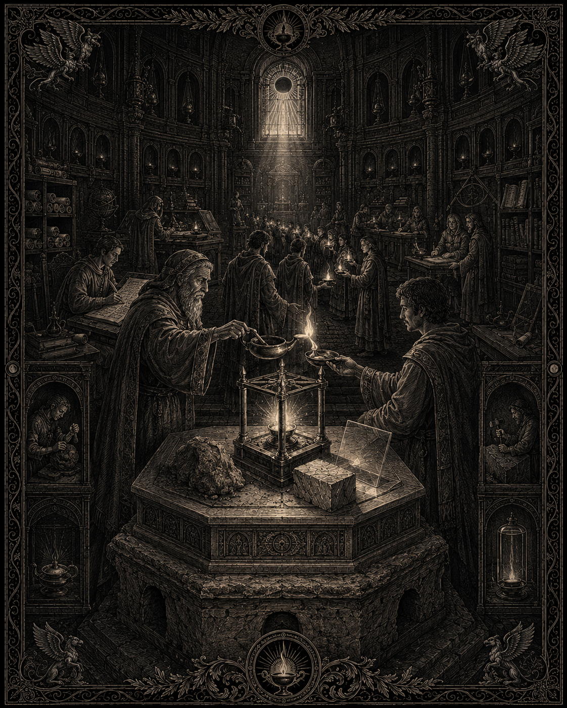
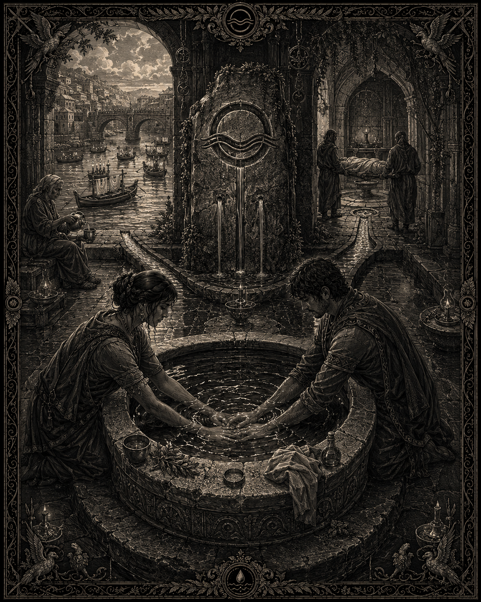
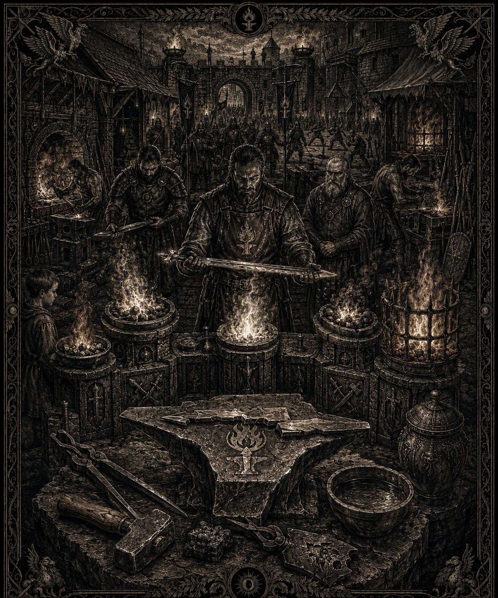

# Les trois dieux humains

## Canon
> Statut : canon

- Trois dieux seulement : **Mahra** (amour, eau), **Mitra** (lumière, connaissances, sagesse), **Mola** (guerre, feu).
- **Mythe de Mitra** : issu de l'argile → pierre → lumière. Ordre intangible.

## Mitra — la Lampe

*Illustration de l’autel de Mitra : la lampe, la transmission du savoir et le passage de l’argile à la pierre puis à la lumière. Statut : draft — support visuel du culte ; l’image ne canonise pas les détails de l’autel ni du rite représenté.*
> Statut : draft

**Le Récit des Trois États** : l'argile apprit et se tint — elle devint pierre. La pierre garda et comprit — elle devint lumière : Mitra. La voie : apprendre, se tenir, garder, s'éclairer.

**Symbole** : la lampe. **Fête** : la Veille des Lampes (solstice d'hiver) — toute lumière éteinte au crépuscule, rallumée à minuit d'une seule flamme transmise de main en main. **Clergé** : lecteurs, copistes, docteurs, juges-assesseurs, gardiens du Registre.

Divergences doctrinales vivantes : École du Potier (l'argile est l'état saint — humilité de l'élève), École du Tailleur (la pierre est l'état saint — discipline, loi), École de la Flamme (la lumière seule compte — surveillée par l'orthodoxie).

## Mahra — l'Eau qui lie

*Illustration de l’autel de Mahra : l’eau, les liens entre les êtres et les rites de passage. Statut : draft — support visuel du culte ; l’image ne canonise pas les détails de l’autel ni du rite représenté.*
> Statut : draft

Domaines : l'amour sous toutes ses charges ; l'eau sous toutes ses formes. Rites de passage (première eau du nouveau-né, mains liées sous l'eau des époux, toilette des morts). Au cœur de la **Question des Cendres** : rendre les corps à la terre et à l'eau est sa voie.

**Symbole** : la vague dans l'anneau. **Fête** : les Eaux-Hautes (printemps) — barquettes portant vœux et dettes pardonnées confiées aux rivières.

## Mola — le Feu qui garde et qui dévore

*Illustration de l’autel de Mola : l’enclume, les cinq feux et la maîtrise du feu protecteur comme du feu dévorant. Statut : draft — support visuel du culte ; l’image ne canonise pas les détails de l’autel ni du rite représenté.*
> Statut : draft

Les cinq feux : du foyer (protecteur), de forge (créateur), purificateur (juge — feu revendiqué à l'Est, cœur de la Question des Cendres), de guerre (le courage), dévorant (l'avertissement). Le fidèle apprend à craindre le feu dévorant en lui-même.

**Symbole** : la flamme sur fer. **Fête** : la Nuit des Forges (automne) — toutes les forges battent jusqu'à l'aube ; on y rebaptise les armes ayant tué injustement.

## Rapports entre les trois cultes
> Statut : draft

Complémentarité officielle : « la lampe, l'eau, le feu du seuil ». Frictions réelles : la **Question des Cendres** (Mola et l'Est veulent brûler les morts pour empêcher leur relève, Mahra tient à la mise en terre) ; rivalité d'influence à la cour ; mépris des docteurs de la Lampe pour la piété simple des campagnes.
