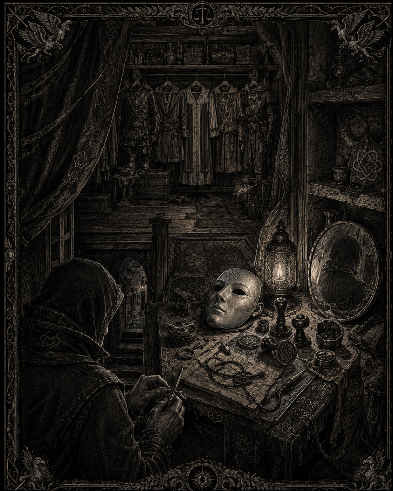
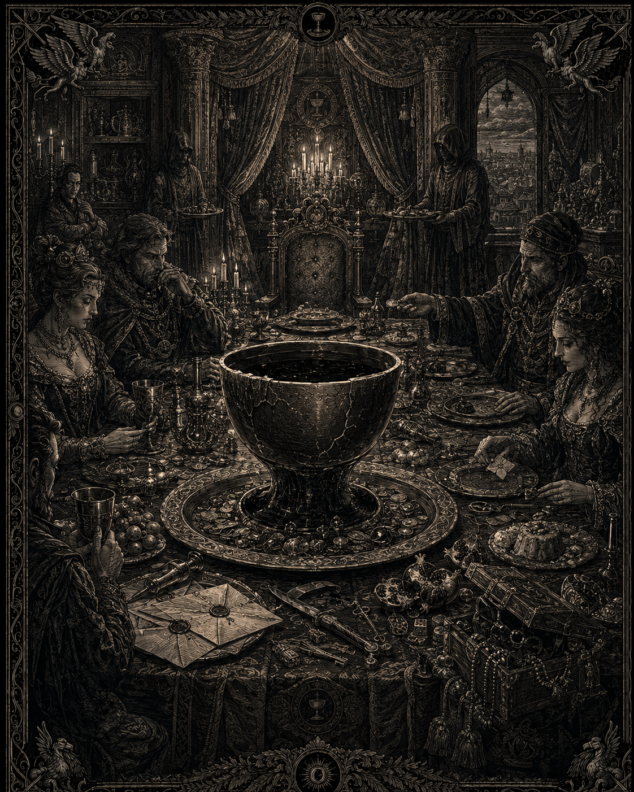
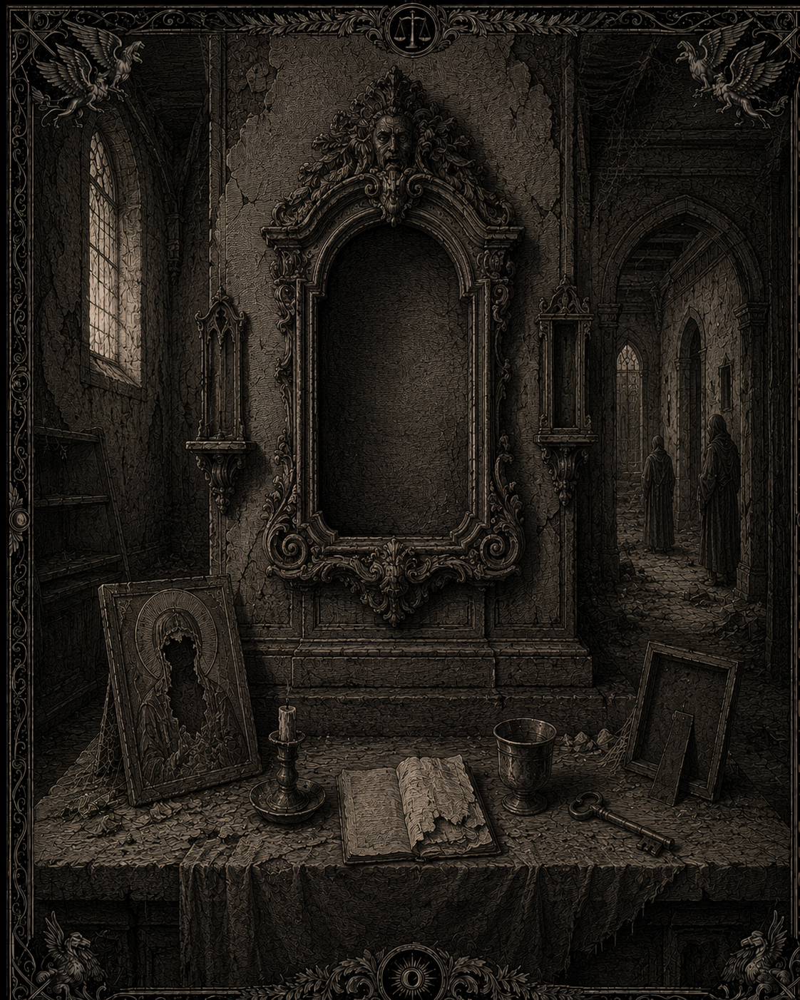

# Les dieux noirs

## Canon
> Statut : canon

- Trois dieux noirs : **Azura** (tromperies), **Atara** (plaisirs), **Mazda** (nom imprononcé dans les textes fictifs — utiliser des titres).
- Adorés par une petite minorité de renégats et certains elfes renégats.
- La majorité des renégats a simplement abandonné les dieux humains.

## Azura — le Manteau de mensonges

*Illustration de l’autel d’Azura : les faux sceaux, les identités substituées et le nœud défait du Serment-Vide. Statut : draft — support visuel du culte ; l’image ne résout pas la doctrine ni ne canonise les détails représentés.*
> Statut : draft

Doctrine : toute vérité est un déguisement plus grand. Le serment est la plus belle des serrures — il suffit d'en posséder la clef. Azura enseigne la *substitution* : prendre la place, le nom, le sceau, la vie d'un autre.

**Culte** : le **Serment-Vide** (faction_empty_oath), dirigé par « le Parjure ». Faux prophètes, serments retournés, agents dormants. Signe de reconnaissance : un nœud défait cousu sous le col.

## Atara — la Coupe sans fond

*Illustration de l’autel d’Atara : l’excès, la table servie et la dette des Cours des Soifs. Statut : draft — support visuel du culte ; l’image ne canonise pas les détails du rite ni de la mise en scène.*
> Statut : draft

Doctrine : le monde est une table servie ; le péché est de se lever avant la fin. Tout plaisir est une prière ; l'assouvir est le rite ; la soif revient — c'est la fidélisation.

**Culte** : les **Cours des Soifs** (faction_courts_of_thirst) — cercles clandestins dans les villes riches. On y entre par invitation, on y reste par dette. Figure connue : **Dame Miel**, jamais la même ville deux saisons.

**Chez les elfes** : les Ronces greffent Atara sur le culte de la sève.

## L'Innommé — le cartouche vide

*Illustration de l’autel de l’Innommé : une absence encadrée, des icônes martelées et le silence des Bouches-Cousues. Statut : draft — support visuel volontairement incomplet ; l’image ne révèle ni ne résout jamais ce que le cartouche contient.*
> Statut : draft

**Identifiant technique** : dark_deity_mazda (documentation uniquement).

**Titres en usage** : *Celui-qu'on-tait*, *le Nom rendu*, *l'Indicible*, *le Souverain sans parole*, *l'Ombre derrière les mots*.

**Ce qu'on constate** — car on ne sait rien : des icônes au visage martelé qui n'ont jamais eu de visage ; des pages saines dont l'encre s'éteint sur un seul mot ; les **Bouches-Cousues** (faction_sewn_mouths) qui ne recrutent pas, n'exigent rien, ne prêchent pas, et qu'on trouve déjà là où quelque chose s'apprête à manquer.

**Symbole** : le **cartouche vide** — un cadre gravé ne contenant rien, au linteau de maisons abandonnées, au revers d'ex-voto. Idéal pour la narration environnementale : le joueur apprend à reconnaître une absence.

**Règle d'écriture** : ne jamais résoudre le mystère. Chaque document sur l'Innommé doit soustraire au moins autant qu'il ajoute.
